# FL Studio Mobile - Home Panel

The Home Panel contains administrative settings grouped according to the SONGS, SETTINGS, SHOP and SHARE tabs.

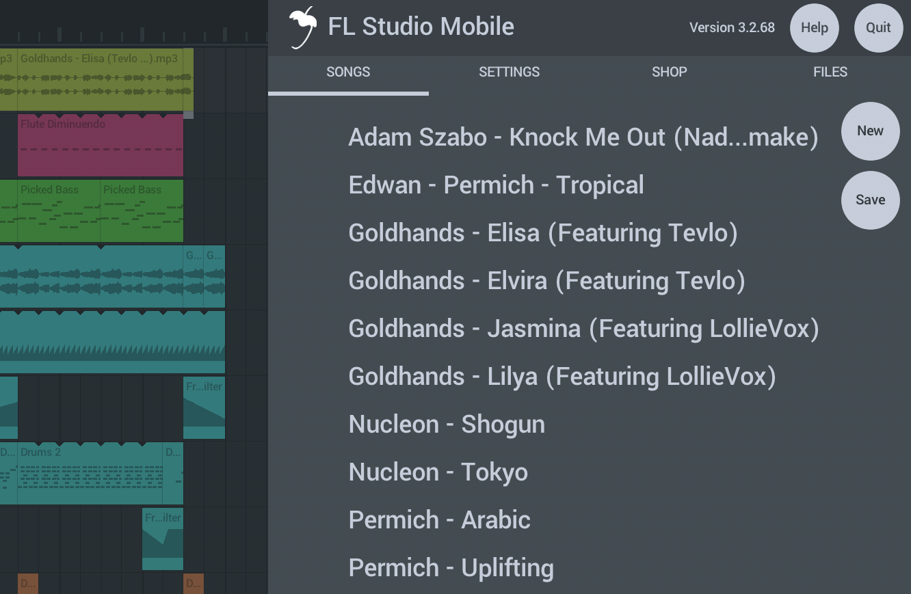

## Parameters

Tap the **Home Button** to access the following:

**NOTE:** Not all features are available on all operating systems.

### HELP (Button)

The help button is your friend! Under it you can find...

*   **Manual** - You are reading it.
*   **Video Tutorials** - An extensive BILIBILI [FL Studio Mobile video playlist][1].
*   **Users & Support Forums** - The [Users Forum][2] is a great place to ask 'How-To' questions, make feature-requests or to report bugs. If something does not work, reporting it is the quickest way to get it fixed.
*   **Play Tutorial** - Play the [introductory video tutorial][3].
*   **Register at Image-Line** - Create an account with us at Image-Line software. This will give you access to the [Users Forum][2].

### SONGS

**Songs** - Load and save FL Studio Mobile projects and MIDI files.

*   **New** - Opens the New Project template.
    
    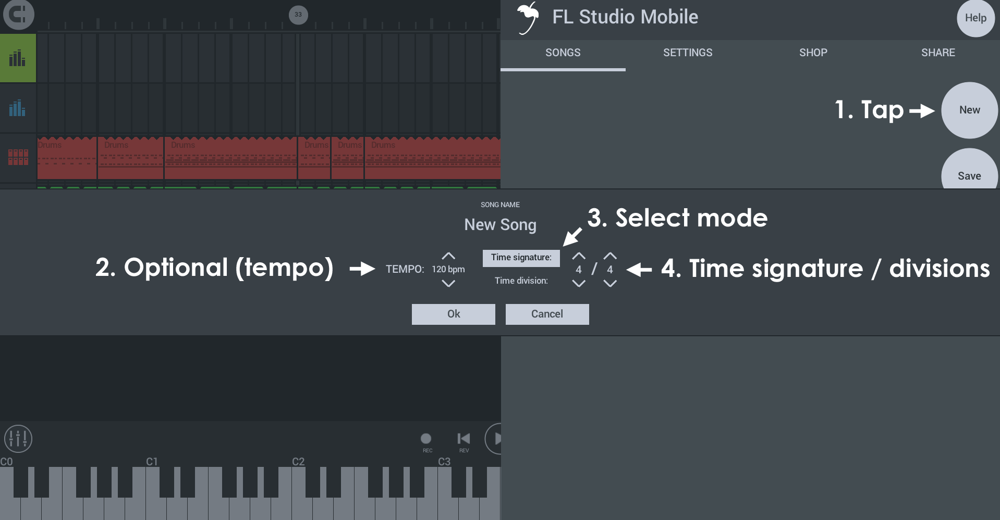
    
    **Starting a new project...**
    
    1.  **New** - Opens the new project dialog
    2.  **Tempo** - Choose from a common range of tempos. You can always change this later or set an exact tempo from the [BPM control][4] on the lower transport bar.
    3.  **Mode** - You can set the time ruler in FL Studio mobile to one of two modes:
        
        *   **Time signature** (traditional) - Select **Beats per bar** / **Beat value**. The Stepsequencer will show 1/16th notes according to the Beat value.
        *   **Time division** (advanced) - Set **Steps per beat** and **Beats per bar**. The Stepsequencer will show the number of steps per beat selected.
        
        **NOTE:** Time signatures and divisions can only be set at the time a project is created. These can't be changed afterward.
        
    4.  **OK** - Start the new project with the selected settings. **NOTE:** Only a single Time Signature can be set per project. You can't change the Time Signature of an existing project.
    
    
    
    
    
*   **Save** - Saves the current project.  
    **NOTE:** Setting a '**SEND**' destination, allows you to send content via email and file-sharing Apps. Options include:
    
    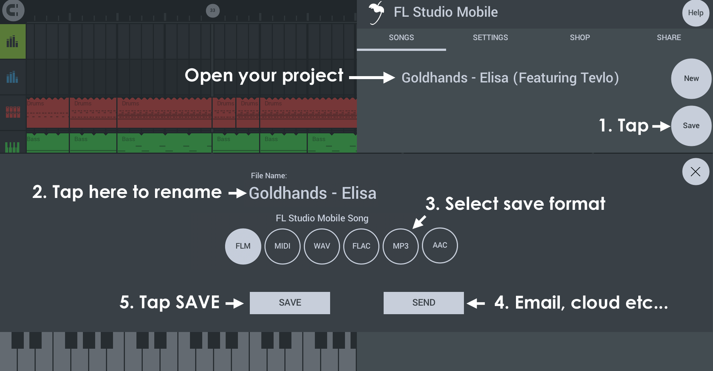
    
    **Saving or sending files...**
    
    1.  **SONGS Tab > Save** - From the SONGS tab select **Save**
    2.  **Rename file** (optional) - If you want to rename the project tap here and enter a new name
    3.  **Select format** - Choose the save format. FLM is a project file. MIDI is note data. WAV, FLAC, MP3 and AAC are audio formats.
    4.  **SEND** (optional) - This is an alternative to saving to your device. Tap here to select email and any other external locations available through Applications that can share files on your device.  
        **NOTE:** This is different to '[SHARE][5]' TAB that allows you share files directly between FL Studio Mobile installations.
    5.  **SAVE** - This saves to the default FL Studio Mobile user data folders. When saving Audio formats you will see the following options:
        
        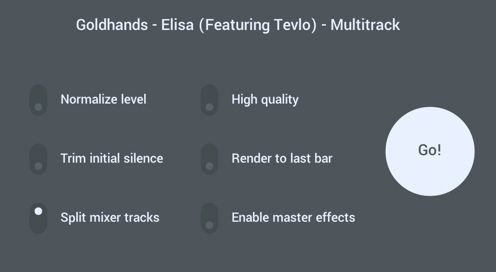
        
        *   **Normalize level** - Maximize level so the loudest peaks reach 100% volume.
        *   **High quality** - Sets highest quality audio. Action depends on render format - WAV 32 Bit (HQ) / 16 Bit (Off). FLAC 24 Bit (HQ) / 16 Bit (Off), MP3 320 kbps (HQ) / 192 (Off). AAC 320 kbps (HQ) / 192 (off).
        *   **Trim initial silence** - Removes silence from the start of the render.
        *   **Render to last bar** - Rendering stops at the end of the last Bar. This can avoid long tails on audio files where effects may run-on.
        *   **Split mixer tracks** - Creates an audio files corresponding to each Playlist track in isolation of the others. These files are often referred to as '**Stems**' and you can use them in other DAWs such as FL Studio, to share projects with friends who may not own the same content or plugins as you OR load stems back into the original project and mute the original to save CPU. **Save location** - Files are saved under **My Files > My Tracks > \[Project Name\] - WAV / FLAC or MP3** depending on the format used.
        *   **Enable master effects** - Split tracks (Stems) will be rendered with the Master Rack effects. When using Stems in another DAW, normally this option is deselected, as this offers more flexibility for subsequent mixing. Select this option if you will reuse stems in FL Studio Mobile, to lower CPU usage. Effects on individual Playlist Tracks are always included. You will need to manually mute effects on each Rack prior to rendering if you don't want these. **NOTE:** As it's impossible anticipate all use cases, and all types of effects present on the Master Mixer Rack, none of the suggestions above are 'rules'. You will need to think through the logic of how you want to use Stems and whether or not you want Master effects present on each one.
*   **File Name** - Tap to edit the file name.
*   **Save format** - Choose the type of file to save.
    
    *   **FLM** - FL Studio Mobile project format (**.flm** extension when viewed in a file browser).
    *   **MIDI** - MIDI is a data format for sharing FL Studio Mobile project data (Notes and control information) with other DAW software (**.mid** extension when viewed in a file browser).  
        **NOTE:** This option saves the first 16 tracks of the project to a single MIDI file. If you have more than 16 tracks you can rearrange the track order and do multiple saves OR save the additional tracks separately with the per-track [Save as MIDI][6].
    *   **WAV (audio)** - Highest quality, large file size. Wave is a lossless audio format and preferred (along with FLAC) for handling audio in a production environment. Files are 16 Bit WAV format (**.wav** extension when viewed in a file browser), unless you have set 'High quality' at save pop-up options (see above) and then it uses 32 Bit format.
    *   **FLAC (Audio)** - Free Lossless Audio Codec, is similar to WAV format in retaining all audio information in the encoded waveform. FLAC has the additional benefit of significantly reducing the file size. FLAC files are typically between 20 to 30% smaller than the equivalent WAV file, all while retaining a bit-perfect copy of the original data. The 'High quality' at save pop-up options (see above) toggles between 16 and 24 bits per sample.
    *   **MP3 (audio)** - Lesser quality, smaller file size. Files are 192 or 320 kbps (HQ) (**.mp3** extension when viewed in a file browser).
    *   **AAC (audio)** - Lesser quality, smaller file size. Files are 192 or 320 kbps (HQ) (**.aac** extension when viewed in a file browser).
    
    **TIP:** Use **WAV** for reuse in FL Studio Mobile and [other DAW software][7]. Use **MP3** for music distribution and listening.
    
*   **SEND** - The destinations shown will depend on your device and operating system (they will be shown AFTER you set '**SEND**' and THEN tap SAVE). Examples include: **email**, **online Cloud storage** and **internal folders**.

**NOTE:** For **advanced file sharing** see the section - [Your Files! (Where are Project, WAV, MP3, MIDI files located?)][8]

### SETTINGS

**Settings** - Select MIDI input/s, CPU/Audio settings and Metronome loudness.

#### MIDI Device

*   **MIDI Input** - When a [external MIDI device][9] is detected you can use this control to set it to play the selected Playlist track.
*   **Enable MIDI over Bluetooth LE** - Select this to connect to Bluetooth MIDI devices. On **Android** this will open a **Location Access** permission. **Location Access permission**. This is [required by Google][10] (See 'LE Beacons note), as it's possible to guess your location from nearby Bluetooth devices. We ONLY use Bluetooth for MIDI keyboards and we DO NOT try to guess your location or send any data to our servers

**NOTE:** For more information on working with MIDI Controllers, [see here][9].

#### Application

*   **Enable count-in when recording** - Skip the count-in when recording.
*   **Display names of the keys on the keyboard** - Adds names for all white notes (A,B,C,D,E,F and G) between the octave names.
*   **Metronome level** - Use this to adjust the relative volume of the metronome. The Metronome can be accessed from the **TMP** button on the Transport Panel.
*   **Normalize rendered songs** - Makes the song louder by increasing the amplitude of the waveform so that the loudest sample is at the maximum possible level. Normalization determines the multiplication factor that will make the loudest waveform peak reach 100%, then multiplies all samples in the waveform by this value, rescaling them.
*   **Control Sizing** - Change the size of the controls to better suit your use-case or device.  
    **NOTE:** You must restart FL Studio Mobile for this setting to take effect.
    **Troubleshooting:** If a scaling option makes the UI unusable, delete the **uiscale** file located in [..\\FLM User Files][8].
*   **Enable sharing** - This enables the [SHARE][5] tab option. Normally you can leave this on. It means FL Studio Mobile will poll the network periodically to see if other instances are in use on other devices. When they are, they will appear as destination options for your data.  
    **NOTE:** When connecting to desktop operating systems (Windows/OS X/macOS) you may see a security pop-up for your firewall. Allow FL Studio Mobile access.

#### Audio

*   **Audio Input** (Shows Microphone by default) - Select the audio input, when multiple inputs are available. On mobile devices with stereo microphones you will see 'Recording Source Stereo' and the option to select the Left or Right Channel (Mic). This is sometimes necessary when one mic is inferior to the other. This can happen if a mic is designed primarily used for noise-cancellation duties and not capturing the voice. When an **Audio Interface** is connected (on mobile devices, [via adapters][11]), other input options will be available. You may need to try them all to find the input you are looking for, if they are not explicitly and correctly identified. Input options on iOS also includes [Audiobus inputs][12].
    
    
    
*   **Enable audio recording latency compensation** - Ensures recorded audio is correctly aligned with the Playlist. For example, if you record the sound of FL Studio Mobile playing it's own kick track, latency calibration will ensure the kick recorded from the microphone is tightly aligned with the sequenced kick. This is necessary because on mobile devices there is usually a significant delay between the time when a sound was generated in the Playlist, to when it is audible from the speakers. This device **audio latency** is usually between 40 and 200 ms. If you are singing or playing in-time with the live audio, you are actually performing between 40 to 200 ms **behind** the sequenced events making the sound. Without latency compensation recordings made in time with live output will lag behind the internal sequencing. The compensation process removes a slice of audio, equal to the detected round-trip audio delay, from the start of the recording. This is the most accurate method to calibrate device latency.
    
    **Calibrate** - To perform a calibration, FL Studio Mobile must be able to record it's own output. The process measures the output-to-input delay for recorded audio by recording a single beep sound.
    
    *   **Using an internal microphone**
        1.  Seek a quiet location.
        2.  Disconnect headphones.
        3.  Turn up the volume to around 80-100%
        4.  Tap **Calibrate**.
    *   **Using an external microphone**
        1.  Seek a quiet location.
        2.  Turn up the volume to around 50%.
        3.  Hold the mic close to a speaker or against one of your headphone speakers.
        4.  Tap **Calibrate**.
    
    **If the calibration fails** - This usually means the calibration beep was not detected. You can usually correct this by
    
    1.  Turning up the volume.
    2.  Making sure not to move, bump or scuff your device while calibrating.
    3.  Making sure you know where the microphone is and that it is clear to receive audio.
    4.  Making sure it is as quiet as possible when you tap Calibrate. **Audio Interface** - Make sure the **Input** selector matches the microphone you are using. Hold the microphone to the headphones.
*   **Use 32 Bit format when rendering and recording audio** - Switches from 16 Bit wav to 32 Bit floating-point wav files for all created, .wav format, audio files.  
    **NOTE:** This format preserves the highest quality when post-processing the audio in another application such as FL Studio for the PC. Only use 32 Bit when you have a specific reason to do so. If you are not sure, use 16 Bit. 32 Bit .wav won't work in many consumer-level media players.
*   **Enable background audio** (iOS) - Allows the App to play when minimized.
*   **Sound mode** (Android) - This is an audio-engine option to reduce audio glitches and or crackling:
    
    *   **Fast** - Lowest latency for devices that can handle this setting. Latency is the delay between tapping on the keyboard and hearing sound.
    *   **Safe** - Can reduce audio glitching at the expense of increased latency.
    *   **Ultrasafe** - Longest latency, but has the widest compatibility with devices.
    
    
    
    **Troubleshooting:** There are two options relating to audio performance, **Multi core processing** and **Sound mode**. Together these give 6 possible combinations. Try them all and see if any combination solves your issues: ON/FAST, ON/SAFE, ON/ULTRASAFE, OFF/FAST, OFF/SAFE & OFF/ULTRASAFE.
    
*   **Multi core processing** - This is a CPU option to reduce audio glitches and or crackling. Multi-core ON may actually be worse than OFF depending on the device used. Try both positions.

### SHOP

**Shop** - You can download free content and or purchase additional content from this tab.

*   **To purchase content** - Tap the **Buy** button and complete the transaction through the App store.
*   **Restore purchases** - Provided you are logged into your device using the **same account** as you used to purchase FL Studio Mobile, and you later re-installed FL Studio Mobile on a new device (or after deleting and installing it on the same device), the **SHOP** tab will show a **RESTORE** button. Tapping this should restore your purchase. For products provided by Image-Line, if you have registered your device with your [Image-Line Account][13], when you re/install FL Studio Mobile on a device, tap the '**Users & support forum**' button, THEN re/registered your device to your Image-Line Account, this **content will be unlocked**.

**NOTE:** In-app purchases, like FL Studio Mobile itself, are not transferable between operating systems (Android, iOS and Windows). For more details on why this is so, see [this Knowledge Base article][14].

### FILES (Backup or Share Files Between FL Studio Mobile Installations)

This tab allows you to:

1.  **Backup** your files to an internet file drive service (Google Drive, OneDrive, Dropbox etc).  
    **NOTE:** Backup will consume space on your Cloud Drive.
2.  **Share files** between devices logged into the same account using an internet file drive service.
3.  **Share files directly** between any devices running FL Studio Mobile, connected to the same network, using WiFi.

#### Cloud Backup / Share

By logging into one of the supported 'Cloud' file sharing services supported (**Google Drive** & **OneDrive**), backup and sync your files online. This will also allow you to share files between devices running FL Studio Mobile and connected to the same account.

1.  **Sign in** - Tap the **Sign In** button and choose a Cloud service to login to. Sign in to the account with your normal login details. **NOTE:** Not all Cloud services are available on all operating systems. Cloud backup is not yet available on Windows UWP.
    
    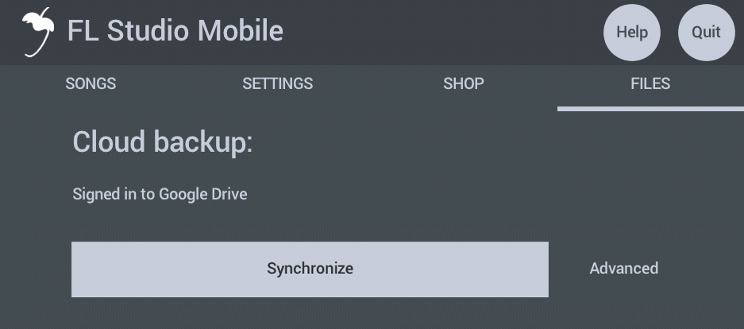
    
2.  **Sync** - After logging in, the **Sync** will appear and allows you to upload your files to the Cloud drive. If there are already files online from a previous backup, or from another device, these will be downloaded. **NOTE:** When the files are in sync, or the Cloud Drive is waiting to be scanned, you will see '**Cloud sync is active**' instead of the **Sync** / **Advanced** buttons.
    
    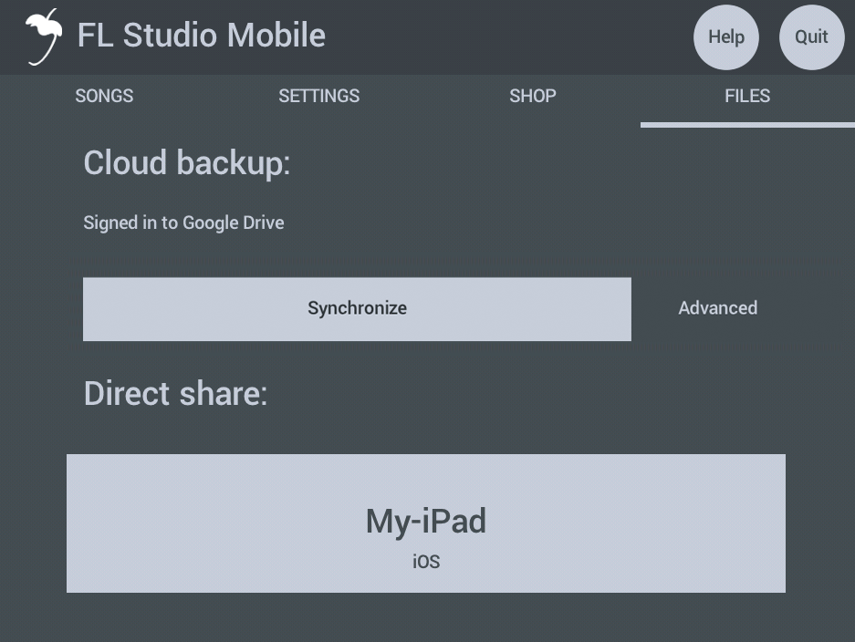
    
    Sync applies default actions based on the following rules, where the '**Cloud**' is your internet file drive:
    
    *   **Upload** - The file is missing on the Cloud Drive **OR** the file was changed locally on your device. **Action:** Upload to Cloud as it is newer on your device.
    *   **Download** - The file is missing locally on your device **OR** the file was changed on the Cloud Drive. **Action:** Download from the Cloud as it is newer there.
    *   **Decide** - The file was changed on your device **and** on the Cloud Drive, so it is not clear which version you want to keep. This can happen if you edit the same project on two devices. In this case you have several options:
        *   **Do nothing** - Ignore this file until the next Sync.
        *   **Delete from cloud** - When uploading, delete the file on the Cloud drive and replace with the file on the device.
        *   **Delete from device** - When downloading, delete the file on the device and replace with the file on the Cloud Drive.
        *   **Keep both** - Renames the filename\_1 to keep copies of both.
3.  **Advanced** - Use the Advanced option to make more detailed changes:
    
    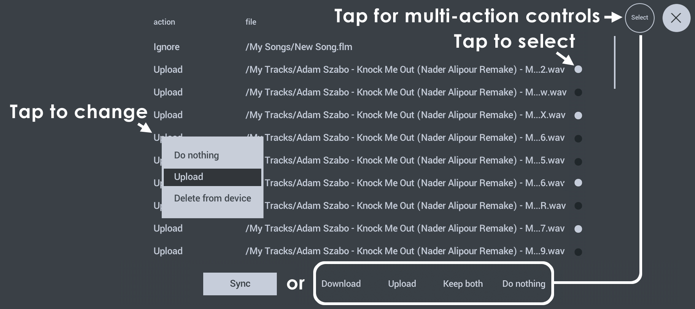
    
    *   **Action** - Shows the default Sync actions, discussed above. You can **tap to change** actions for individual files. To apply the actions shown on the Advanced dialog, press the Sync button at the bottom of the list. Once the window is closed, the system will revert to defaults as described above for the next Sync.
    *   **File** - Each file to be processed is listed. You can make bulk changes by tapping the **Select** button and then using the select icons and using the new controls that appear (Upload, Download, Keep Both, Do nothing). Keep Both is useful when there is a **Decide** conflict. That is, there is a file in the cloud and on the device, both of which, are changed.
    *   **Select** - Changes the lower button from **Sync**, to the options shown below. Tap Select, then use the individual file 'Select' icons, to choose the files you want to change and finally choose one of the Select options along the bottom:
        
        *   **Download** - Replace the file on the device with the one in the cloud.
        *   **Upload** - Replace the file in the Cloud with the one on the device.
        *   **Keep both** - Create an name\_1 version of the file and keep name and name\_1.
        *   **Do nothing** - Ignore this file until the next Sync.
        
        **NOTE:** To delete files from the Cloud you need to delete the same file on all devices. Otherwise, it will be uploaded to the cloud again on the next Sync from a device containing it.
        

#### Cloud Drive Notes

**Supported Cloud Services** - Not all services are available on all Operating Systems. While it is possible to view the **FL Studio Mobile** Cloud folder on all Cloud Drive services, from a Web-browser, not all drives allow you to edit or add to the data in the Cloud. See below for the specific limitations and features of each Cloud Drive service:

*   **Deleting files** - When Cloud Sync is in use, you must delete them from **all** devices. Otherwise the file/s will be re-uploaded to the Cloud Drive when a synced device contacts the Cloud Drive. FL Studio Mobile will **only delete files from the Cloud Drive**, not from **cross-synced devices**, to minimize the risk of deleting important user files.
*   **Update frequency** - When Sync is set to **Manual** the Cloud Drive is checked when the FILE tab is opened and then at 30 second intervals, so be patient if the Sync button does not immediately appear. When set to **Automatic** the Cloud Drive is checked every 2 minutes for updates. The Cloud Drive is also checked upon opening the FILES tab. When you see **Cloud sync is active**, this means all files are in sync **or** the device has not accessed the Cloud Drive yet, and does not know about pending changes.
*   **Target folders** - FL Studio Mobile will only share data with the following locations: My Drumsets, My Instruments, My MIDI, My Presets, My Recordings, My Samples, My Tracks and My Songs. You can't rename these folders on your Cloud Drive, they must remain as set.
*   **[Google Drive][15]** (Google) - FL Studio Mobile has **limited permissions** to access your drive. It will create a folder called **FL Studio Mobile** in the root of your drive. It can only access files that were uploaded by itself and won't be able to 'see' any files that you add directly to your Google Drive folder via a Web-browser or any other application, other than FL Studio Mobile.
    
    **NOTE:** Google Drive **does not allow** you to manually add files to the FL Studio Mobile folders, as a way of adding content to your device, it will only see files it has put on your drive. **You can**, however, delete files manually on the cloud drive and this will be reflected on your device in the next sync.
    
*   **[OneDrive][16]** (Microsoft) - FL Studio Mobile has **limited permissions** to access your drive. It will create a folder called **FL Studio Mobile** in the Apps folder of your Cloud Drive and it can only access this folder. Once the parent folder is created, you can rename it, move it OR **add your own files in the sub-folders, listed above**. In this way you can quickly add files to your connected FL Studio Mobile installations via any Web Browser. The only limitation is that FL Studio Mobile can't see files in the **Trash folder**. Once you delete files in the cloud, FL Studio Mobile will consider them missing and try to re upload them from your device. So you will need to delete files on your device to delete them on OneDrive.
    
    **NOTE:** OneDrive allows you to manually add files via a Web Browser to the FL Studio Mobile folders, as a way of adding content to your device.
    

**NOTE:** Cloud Drive features are controlled by their respective developers. We can't add features that are not supported by the services, or change how they function. As security is a high priority on these services, FL Studio Mobile can't access any parts of your drive it did not create.

#### Direct Share

**Share** - You can share project related files between your mobile devices running FL Studio Mobile. When your devices are [connected to the same network (including WiFi)][17] choose a target device receive '**Your Files**', that is everything in the **FLM User Files** folder. This page allows you to sync projects across a network and between FL Studio Mobile installation on ALL detected Android, iOS and Windows (App and FL Plugin) devices. **NOTE:** The first time you do this with a computer, you may see a **Firewall pop-up security message**. Allow FL Studio Mobile access to your Network. **How to Share:**

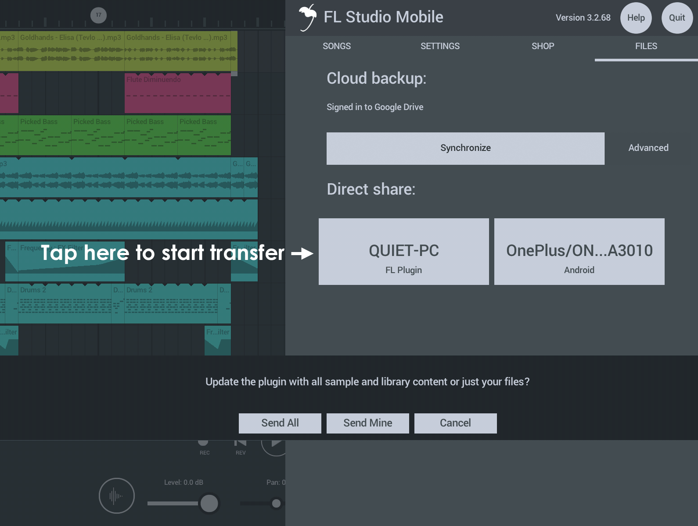

https://www.bilibili.com/video/av29552167?p=3

1.  Make sure you are using the latest version of FL Studio Mobile on your device AND have the latest FL Studio plugin update - [get it here][18].
2.  Connect your PC and or any Mobile devices to the same network. Normally this will be via **WiFi**, but it's OK if you have a combination of WiFi and **Ethernet** connections. The important factor is **all devices are connected to the same Network**.
3.  Open FL Studio Mobile on the PC and on the Mobile device.
4.  From the PC and Mobile device/s select the **Share** tab.  
    **NOTE:** On the PC, the first time you do this, you will see a **Firewall pop-up security message**. Allow FL Studio Mobile access to your Network.
5.  On the **Share** tab, you should see all other instances of FL Studio Mobile, on all devices listed. Sharing goes **FROM** the device you are using **TO** the one you select.
6.  Tap on the device and **Your Files** (see below) is transferred to that device.
7.  You will need to restart the destination FL Studio Mobile instance to see the new data as it is scanned at start-up.
8.  Make a shortcut on your Computer desktop to your My Files location, then you can manually copy files in and out of this location and then use SHARE to send them to your Mobile Device, or get them after a SHARE to your computer, easy!

**IMPORTANT NOTE:** The first time you use the **FL Studio Plugin** version, you should **Send All** library content to it. By default, the plugin version only ships with a limited library of sounds so you will need to update it with the complete library from a Mobile version. If you don't do this, projects will be missing sounds on the plugin version. This can take several minutes to complete.

## Managing User Files

This section relates to the internal file browser that opens when you choose Presets or add Audio Clips. The options here are available **only for user files**. They do not apply for factory installed content.

#### Working with files

1.  Tap Select open the file management options.
2.  Tap 'select' buttons for the files you want to manage.
3.  Choose the option/action you wish to perform for the files.

#### Options

*   **All** - Select all files.
*   **Fold** - Create a folder and move selected files to it.  
    **NOTE:** You must select files to create a folder.
*   **Delete** - Delete selected files
*   **Cut** - Choose files ready for moving to another location (Paste).
*   **Paste** - Paste Cut files.
*   **Export** - Export files with the OS supplied sharing options.
*   **Wave** (iOS only) - Audio Paste.

## Finding Your Files

Using mobile devices as creative tools can be frustrating as mobile Operating Systems (Android, iOS and Windows UWP), more or less, prevent easy access to internal folders used by Apps. Operating System specific instructions are [provided below][17] on how to access these folders. Under the FL Studio Mobile installation folder you can find the following sub-folders. Initially these folders are empty, they are for your data:

**FL Studio Mobile install sub-folders:**

*   **My Drum templates** - Drum templates are collection of sounds that make up a drumkit. This is not drum-sample data, it's preset data that loads the samples into a Drumkit.
*   **My Instruments** - Place **[DirectWave][20] Program (.dwp)** instrument files, including the sample sub-folder and the legacy-format FLM2 (**.instr**) format here. You can export .dwp and .instr directly from the [FL Studio (PC version)][21] > [DirectWave][22] (plugin) > [PROGRAM > Right-click the Program label][23] and select '**Save program**'.
*   **My MIDI** - Contains all MIDI format files **(.mid)**. These will show at the main [SONGS Menu][24] and on the [Channel Menu][6] ('Import MIDI Tracks' and 'Save as MIDI').
*   **My Presets** - This folder contains all plugin presets (Instruments and Effects). There are no sub folders as presets contain meta-data inside the presets so FL Studio Mobile will only show compatible presets in the plugin you open to load them. Example files are MiniSynth (**.flms**) and all other presets including GMS, Transistor Bass and FX Modules (**.flmpst**).
*   **My Recordings** - Audio recordings made from within FL Studio Mobile. WAV (uncompressed format, 16, 24 or 32 Bit). See **NOTE**.
*   **My Samples** - One-shots, samples, sounds anything you want to include in WAV (uncompressed 16, 24 or 32 Bit format) or MP3. See **NOTE**.
*   **My Songs** - Project files. These show at the top of the list on the **Home Page > Songs** tab.
*   **My Tracks** - These audio files that are created when you render projects. Make sure to render to **Lossless** (WAV) or MP3 format if you want to re-use a track in FL Studio Mobile (create a new Playlist track of type 'Wave' to load). **Compressed** (AAC format) files will not show for use in FL Studio Mobile. These will play in your Media Player however.
    
    **Save CPU:** you can convert any Playlist Track to audio by Soloing it and rendering to Uncompressed (WAV) format from the **Home page > Songs > Render** button. Then load it back into the Playlist with the **\+ button > Audio Wave** option (locate your render and load it).
    

**NOTES:**

1.  You must **restart FL Studio Mobile after adding new samples** for them to be scanned and be available for use.
2.  Locations in FL Studio Mobile that load sample data - **[Drum Sampler][25]**, **DirectWave** and the **Audio Clip** will scan **My Recordings**, **My Samples** and **My Tracks** for WAV (uncompressed, 16, 24 or 32 Bit) and MP3 (compressed) data and present it as a load option. So, you can also copy WAV/MP3 files to any of these locations. Too keep things organized, use 'My Samples' for your tuned and untuned instrument/percussion samples. 'My Recordings' for vocals and instrument samples. 'My Tracks' for stems and completed songs.

### Accessing, Exporting & Importing Your Files (WAV, MP3, MID, FLM, etc)

This section shows you how to get access to your data on each of the supported App platforms. This is so you can upload and download **custom samples**, **instruments**, **presets**, **music** and any other files as used above.

#### All Operating Systems: Using SHARE

If you have access to a Desktop PC, by far, the easiest method is to use [SHARE with the FL Studio Plugin][5] TO and FROM the Mobile Device. In this case, add content to the FL Studio Mobile plugin folder on your PC, then SHARE to the mobile device. Or SHARE from the device to your PC. Alternatively, proceed as follows:

#### Android File Management

Android allows direct access to internal folders, there are two main options:

1.  Connect your device to your computer with a **USB cable**. Then set the device to work in '**Data transfer**' mode. You should now have drag-and-drop access to your Data Folders. You will need to find the **FLM User Files** folder. This is usually in the root/top of the main storage.
    
    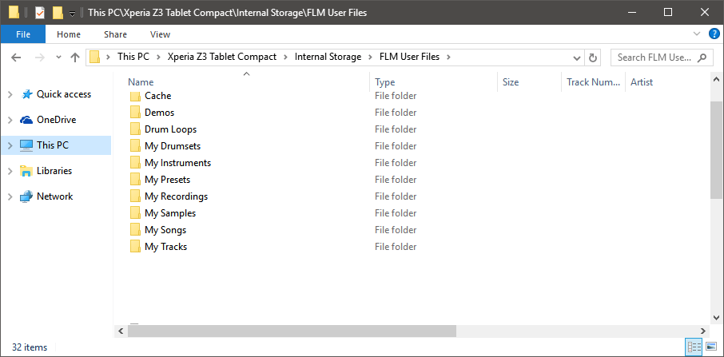
    
2.  **OR** 2. Use [AirDroid][26] that will allow you to use a **Web Browser** to access folders and files on any Android device (works on Windows and Macs). If you are working internal on an Android device, [Total Commander][27] will allow you to copy and paste your files between folders on the device. There are also a number of [plugins available][28] for working across networks, for example a [LAN plugin][29].
    
    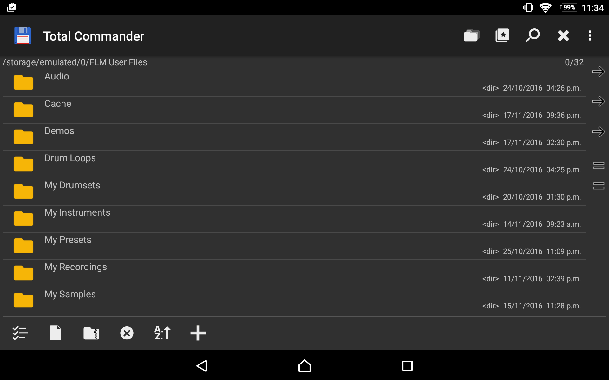
    

#### Apple iOS File Management

There following methods are available:

1.  **System Import** - iOS will recognize most file-types associated with FL Studio Mobile (.flm, .mid, .flmpst, .flms, .wav, .mp3) in emails, Cloud storage etc, and allow you to open them with FL Studio Mobile. **Long-tap on the attachment or file**, as show in your email or Cloud storage App, then select **FL Studio Mobile** from the pop-up options to open the file.
    
    
    
    When FL Studio Mobile starts, the file will be moved to the appropriate folder in the App. This method works, one file at a time.
    
    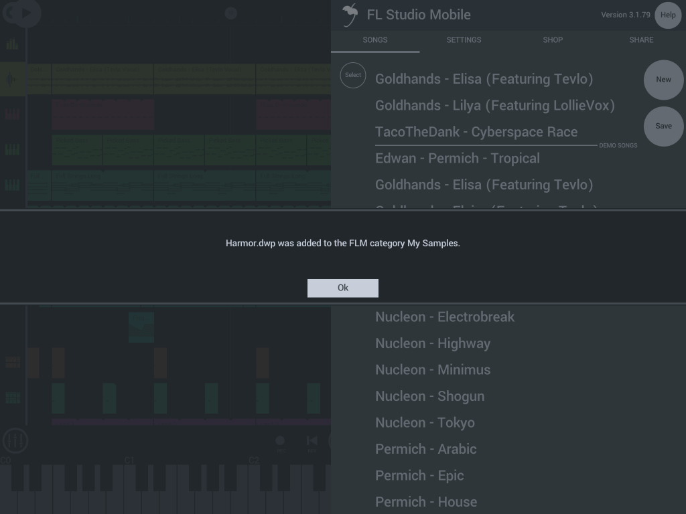
    
2.  **iTunes Import/Export** - Connect your iOS device to your computer with iTunes. After syncing and selecting FL Studio Mobile 3, you will have access to the **FLM User Files** folders. You will be able to copy these folders in their entirety FROM FL Studio Mobile TO your computer via iTunes. (**YOU MUST** **select the files and or folder/s** and then use '**Save to...**' from iTunes. This will allow you to send files and folders across to your computer. You can't look inside these folders in iTunes.
    
    To **upload all file types** (.flm, .mid, .flmpst, .flms, .wav, .mp3 etc), TO FL Studio Mobile, use the '**Add File...**' button so add files to the Root Folder of FL Studio Mobile. These will show under **My Samples**, **SONGS** and other appropriate locations in FL Studio Mobile automatically, the next time you restart the App.
    
    
    

#### FL Studio Plugin File Management

**NOTE:** From FL Studio Mobile 3.2.47 up, the data location for the plugin moved from **C:\\Program Files (x86)\\Image-Line\\FL Studio N\\Plugins\\Fruity\\Generators\\FL Studio Mobile\\LocalData** to the **FL Studio User data folder** ...

Make a desktop shortcut to the **FL Studio User data folder**. Under **\[user\]\\Documents\\Image-Line\\FL Studio Mobile\\**. This is the same location for macOS and Windows. Then you can drag and drop any content to and from the folders as you need. Use the [Sharing function][5] to send this to your mobile device AND also back to your Windows or Mac computer.

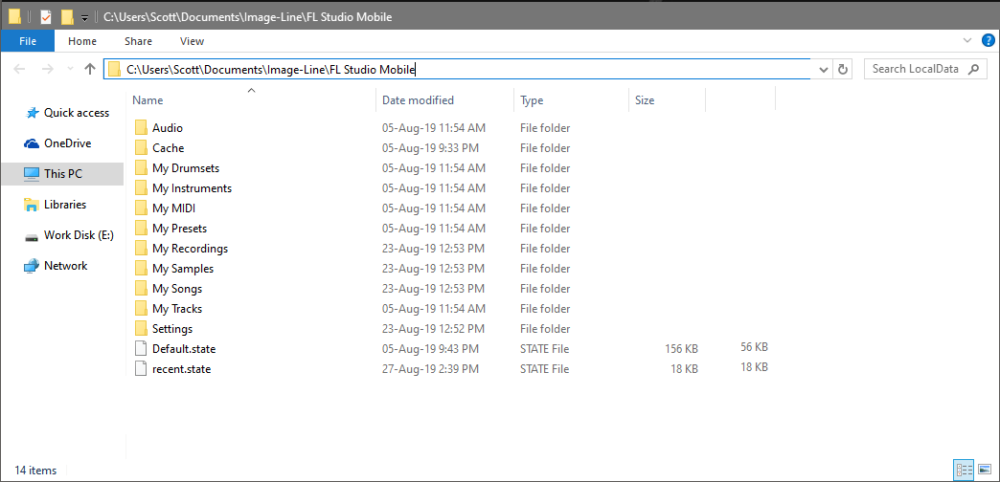

#### FL Studio Windows App File Management

The following options are available:

1.  **Windows App (Windows Desktop)** - Make a desktop shortcut to the FL Studio Mobile user data folder. The path has some custom data as shown in red. Normally under **C:\\Users\\YOUR\_ACCOUNT\\AppData\\Local\\Packages\\Image-Line.FLStudioMobile\_RANDOM\_LETTERS\_NUMBERS\\LocalState**.    
    **NOTE:** the **AppData** folder is hidden, so you will need to have '**Show hidden items**' selected in the file browser. If you don't have **permission to enter the folder**, check [this guide][30]. Windows 8 and 10 are the same in this regard.
    
    
    
    **TIP:** The quickest way to find it is to save a project with a unique name... 'Lapooterbeekus' and search your **C:\\Users\\..** for it (Windows folder, usually C drive). Make sure 'Show hidden items' is selected in your Windows file browser.
    
2.  **Loading from within the App** - It's not possible to browse audio files in folders external to the App from FL Studio Mobile. To load audio files external to the App, open a regular Windows File Browser, then right-click the target file and choose '**Open with > FL Studio Mobile**'. This will import the file to the App.
    
    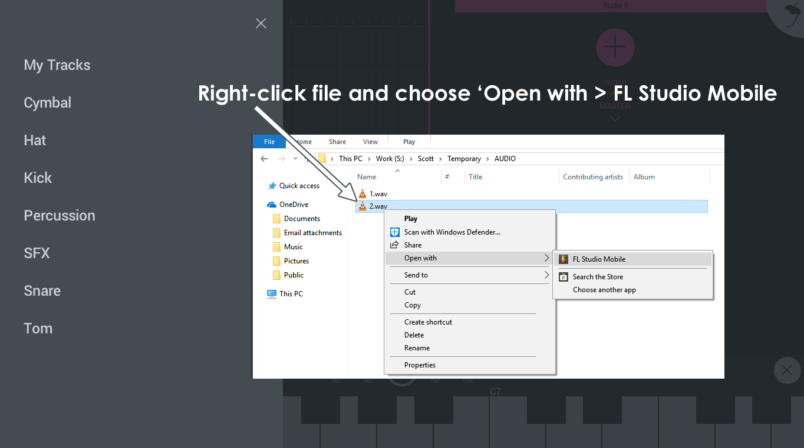
    

#### Windows Phone App File Management

It's not possible to access the FL Studio Mobile installation User folder on a Windows Phone. You have the following options:

1.  **To export data**\- Two options ...
    *   Use the '**Destination**' option to save your content to one of the folders visible when the phone is connected to a PC (or OneDrive).
    *   Install the App on Windows for PC (you get both the Phone and Desktop App). **Follow the Windows App (Windows Desktop)** instructions above to use the [SHARE][5] function.
2.  **To import data** - Two options ...
    *   From the Playlist, tap the (+) button to add an **Audio Track**, then choose '**Import Sample**' and this will open a sample import dialog. After import the sample will be in **My Files > My Samples**.
    *   Install the App on Windows for PC (you get both the Phone and Desktop App). **Follow the Windows App (Windows Desktop)** instructions above to use the [SHARE][5] function.

[1]: https://www.bilibili.com/video/av29552167
[2]: http://support.image-line.com/redirect/flmobile_forum
[3]: https://www.bilibili.com/video/av80167389
[4]: Playlist.md#flmobile_transportbar
[5]: #sharingdata
[6]: Playlist.md#channel_menu
[7]: FLStudioPlugin.md
[8]: #userdata
[9]: Controllers.md#flm_externalcontrollers
[10]: https://developer.android.com/guide/topics/connectivity/bluetooth-le.html#permissions
[11]: ../assets/home/adapters.jpg
[12]: iOS_InterApp.md
[13]: https://support.image-line.com/member/profile.php
[14]: https://support.image-line.com/knowledgebase/base.php?ans=497
[15]: https://drive.google.com/drive
[16]: https://onedrive.live.com/
[17]: WiFi.md
[18]: http://support.image-line.com/redirect/flmobile_flplugin
[19]: #userdata_access
[20]: Module_DirectWave.md
[21]: http://www.image-line.com/flstudio/
[22]: https://www.image-line.com/support/flstudio_online_manual/html/plugins/DirectWave.htm
[23]: https://www.image-line.com/support/FLHelp/html/plugins/Directwave_zonewindow.htm
[24]: #songs
[25]: Editors.md#stepsequencer
[26]: http://play.google.com/store/apps/details?id=com.sand.airdroid
[27]: http://play.google.com/store/apps/details?id=com.ghisler.android.TotalCommander
[28]: http://www.ghisler.com/androidplugins/googleplay/
[29]: https://play.google.com/store/apps/details?id=com.ghisler.tcplugins.LAN
[30]: http://www.fixedbyvonnie.com/2013/12/where-are-apps-in-the-windows-store-installed