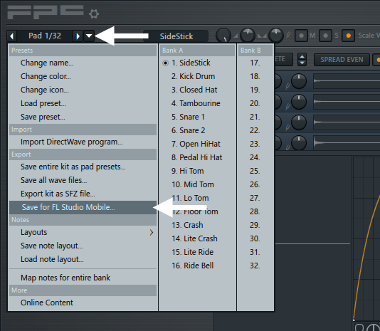

# DirectWave

DirectWave is a sample player and is useful for traditional sounds such as **Piano**, **Orchestra**, **Guitar** etc. There are many included sample banks, you can purchase more from the [in-app shop][1] or create your own (see below). There is also a thread on the FL Studio Mobile users forum ([linked here][2]) where many are available.

**To load instruments** - Tap the preset selector on the upper-right of the interface (where it says 'Default' in the image above) and choose presets from the pop-up browser on the left of screen. See the NOTE below about adding your own custom samples.

## Parameters

DirectWave is an easy-to-use sample player. It can play single samples or multi-samples.

*   **Pitch** - Transpose the Pitch +/- 24 semitones (2 octaves).
*   **Fine Tune** - Transpose the pitch +/- 100 cents (1 semitone).
*   **Attack** - Time taken for the filter to reach the maximum level.
*   **Decay** - Time taken to go from the maximum level to the Sustain level.
*   **Sustain** - Level when the key is held.
*   **Release** - Time taken to fall from the Sustain level to zero when the key is released.
*   **Slide time** - Time taken to slide from one note to another. **Legato** mode will restrict slides to overlapping notes.
*   **Loop** - Turn sample loops on/off. This will depend if the sample already has inbuilt loop-points.
*   **Legato** - When notes overlap they will slide from one to another, depending on the **Slide time** setting. When legato mode if OFF all note changes will slide depending on the time.
*   **Reverse** - Reverse sample (loop must be disabled for this to work).
*   **Mono** - Monophonic mode. New notes will cut sustaining ones. When in **Legato** mode, new notes will slide from one to another, but the original sample will be used on the second note.

**NOTES:**

*   **Where does DirectWave look for samples?** - DirectWave will scan [**User Files**][3] for any WAV (8, 16, 24 or 32 Bit) and MP3 format samples. It will also scan for **.instr** and **.dwp** multi-sampled instruments (see below).

### Make your own multi-sample instruments

DirectWave will load **.wav**, **.mp3**, **.dwp** (DirectWave Presets) and **.instr** (FL Studio Mobile Instrument). While **.mp3** and **.wav** are restricted to a single sample, played across the keyboard, **.dwp** and **.instr** formats support multi-samples, where each key can contain a unique sample or sound. About **.dwp files**; These are native to the [FL Studio DirectWave Sampler][4] and **there are two .dwp formats:**

*   **Monolithic** - Contains all the multi-sample data in a single **.dwp** file. **This is the ideal format for working on Mobile devices** as it's a single file and easy to manage.
*   **Standard (not recommended!)** - An instrument patch includes the **.dwp** program AND **associated sub-folder** (with same name as the .dwp), that contains the sample data. This format is favored by FL Studio pc users as they can access and edit the patch sample data easily. However, as managing groups of files and sub-folders is complicated on mobile devices, **we strongly recommend monolithic .dwp format instead**.

There are several ways to create DirectWave patches using FL Studio for the Desktop:

1.  **[Channel Sampling Robot][5]** - Available in **FL Studio 12.5** and later. This will create monolithic DirectWave patches from any plugin in the [Channel Rack][6]. Right-Click a Channel Rack button and select '**Create DirectWave instrument**'. Make sure '**Monolithic file**' is selected on the options.
    
    
    
2.  **[FL Studio DirectWave Sampler][4]** - If you own DirectWave for PC, you can export monolithic **.dwp** files by selecting the 'Disk operations menu' (folder icon at the top-left of the GUI) and choosing '**Save for FL Studio Mobile**'. This will create a monolithic .dwp file based on the current patch.
    
    
    
3.  **[FPC (Fruity Pad Controller)][7]** - From the menu indicated below, you can export monolithic **.dwp** files by selecting the '**Save for FL Studio Mobile**' option.
    
    
    

#### Transferring .dwp and .instr files to FL Studio Mobile

Normally you want to transfer **.dwp** and **.instr** files for DirectWave into the **My Instruments** folder. To transfer the preset/s into FL Studio Mobile there are several methods:

1.  **FL Studio for the Desktop** - Put the files you have created into the **FL Studio Mobile plugin** installation folder **C:\\Program Files (x86)\\Image-Line\\FL Studio \[version number\]\\Plugins\\Fruity\\Generators\\FL Studio Mobile\\LocalData** then use the [Share function][8] to send to your mobile device.
    
    https://www.bilibili.com/video/av29552167?p=3
    
2.  **System transfer** - Open the .dwp or .instr preset within a mobile App that shows that file type (such as email). It will be copied to FL Studio Mobile.
    
    
    
3.  **Manual transfer** - Copy the **.dwp**/**.instr** files to [Your Data/My Instruments][3]. If you are using an iOS device, put the file/s in the root [User Data folder via iTunes][9]. **OR** Open the **.dwp/.instr** files in any browser, email etc. on your device. FL Studio will be shown as an open option. Doing this will import them into [Your Data/My Instruments][3] (use monolithic .dwp).

### But wait! There's more...

**FREE STUFF!** - There is a thread on the FL Studio Mobile users forum, [linked here][2], where users are sharing their **.dwp** and **.instr** patches.

[1]: HomePanel.md#shop
[2]: http://support.image-line.com/redirect/FLM_user_library
[3]: HomePanel.md#userdata
[4]: https://www.image-line.com/support/FLHelp/html/plugins/DirectWave.htm
[5]: https://www.image-line.com/support/FLHelp/html/plugins/DirectWave.htm#DirectWave_ChannelSampler
[6]: https://www.image-line.com/support/FLHelp/html/channelrack.htm
[7]: https://www.image-line.com/support/FLHelp/html/plugins/FPC.htm
[8]: HomePanel.md#sharingdata
[9]: HomePanel.md#userdata_ios