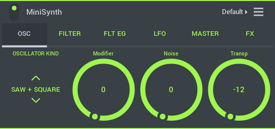
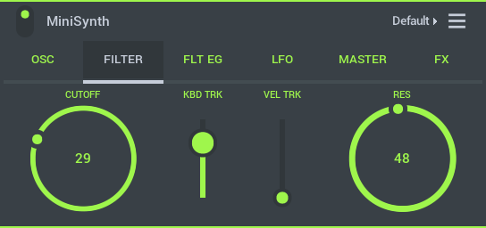
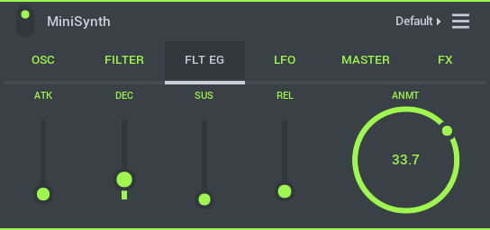
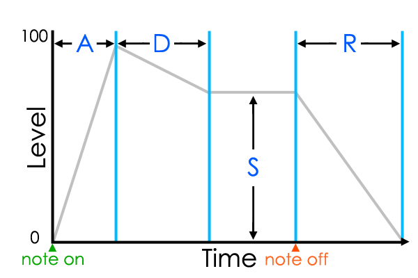
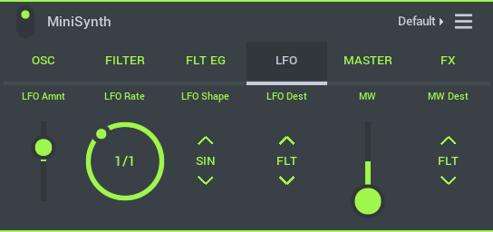
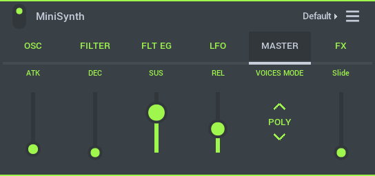
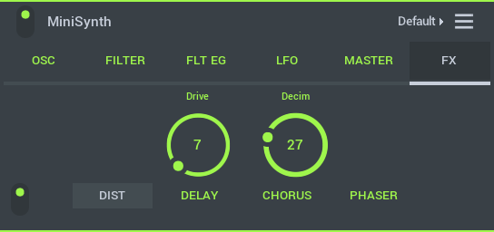
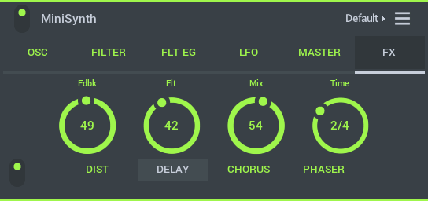
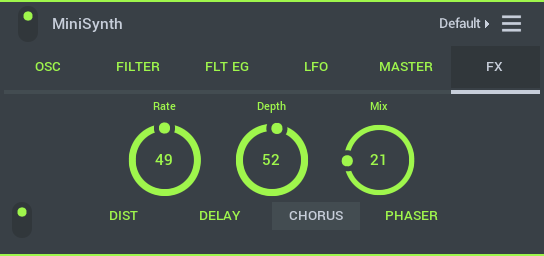
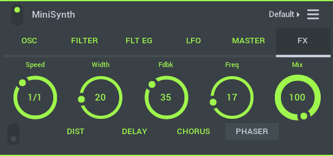

# Minisynth

MiniSynth is a fully featured synthesizer with a low processor overhead and great sound. Load the presets or create your own sounds from scratch. There are 6 tabs covering the synthesizer controls.

### Video Tutorial

https://www.bilibili.com/video/av29552167?p=28

## Parameters

Minisynth is fully compatible with the [FL Studio Plugin version][1]. You can share presets between the two. Download them from the [Minisynth Users Forum][2] and put them under **Your Data > [My Presets][3]**. As the plugin controls are identical, the following tutorials are relevant to MiniSynth on FL Studio Mobile: [See here][4].

### Oscillator

Oscillators are the sound source for the synth. MiniSynth has an advanced multi-mode oscillator that changes architecture depending on the waveform selection. Some waveform modes are dual-voice where two waveforms are mixed others can be up to 8 voice. A voice is a single, pitchable tone.

*   **Oscillator** - Controls for the waveform shape and pitch.
*   **Waveform** - Choose the wave-shape. Depending on the selection there are some unique behavior of the voices.
    *   **Saw** - A Saw + Square wave of the same frequency and phase. **Modifier** controls pulse width of the Square wave, so in positions 0 or 100 pulse width becomes zero and a perfect Saw wave is produced.
    *   **Saw + Saw** - Pair of Saw waveforms. **Modifier** controls pitch of the second saw +/- 24 semitones.
    *   **Pulse** - Pair of Square waveforms. **Modifier** controls pulse width of the waveform so that at 0 or 100% there is complete phase cancellation.
    *   **Square + Saw** - Square and Saw wave. **Modifier** controls pitch of the saw +/- 24 semitones.
    *   **Square + Square** - Pair of Square waveforms. **Modifier** controls pitch of second square +/- 24 semitones.
    *   **SuperSaw** 8 Saw waves panned in the stereo field. **Modifier** detunes the 8 voices.
    *   **Bell** - Saw-like waveform. **Modifier** - adds in additional spectral frequencies.
    *   **DeafSaw** - Two Saws with same frequency. **Modifier** - Adjusts phase shift of the Saw waves relative to each other creating a 'comb filter' effect.
    *   **Spread Oct** - 2 Saw waves at 0 octave (root) and +1 octave intervals. **Modifier** detunes the second Saw.
    *   **Spread 5th** - 2 Saw waves at 5 semitones apart. **Modifier** detunes the second Saw.
*   **Transpose** - Transpose the oscillator +/- 12 semitones.
*   **Modifier** - Action depends on the selected waveform type, see above.
*   **Noise** - Adds white noise (hiss) into the mix.
*   **Voice Mode** - Polyphony (ability to play more than one note) and voice transitions.
    *   **Poly** - Polyphonic, play up to 8 notes.
    *   **Mono** - A monophonic mode (one note playback), slides always sound on note changes and envelopes reset.
    *   **Lead** - A monophonic mode where auto-portamento is enabled (when notes overlap) and the envelopes are not retrigged. This allows you to play normal lead melodies without the slide (portamento) effect and then add it where you want by holding the previous note before playing the next.
*   **Mod Wheel** - Select Modulation targets. **NOTE:** Mod Wheel is only available when a MOD Wheel MIDI controller is connected.
    *   **Filter** - Modulation will affect the filter cutoff.
    *   **LFO** - Modulation will affect the LFO speed.
    *   **Amount** - Multiplier for the Mod wheel effect.

### Filter

MiniSynth uses a single Low Pass filter with cutoff and resonance controls. Low Pass filters allow frequencies below the cutoff frequency to pass. When set to the highest frequency this means all frequencies can be heard. When set low, only the lower frequencies will be heard.

*   **X/Y Control** - **Horizontal** - Filter cutoff frequency (the filter is of the low pass type), **Vertical** - Resonance. This causes a peak at the cutoff frequency that is most noticeable when the cutoff frequency is changed.
*   **Keyboard** - Filter Cutoff frequency can be set to increase (turn right) or decrease (turn left) with keyboard position. This is useful to open or close the filter as you progress up the keyboard, so higher keys are brighter sounding for example.
*   **Velocity** - The filter be set to increase (turn right) or decrease (turn left) with keyboard velocity. This is useful to open or close the filter as you play louder notes, so keys played hard (high velocity) are brighter sounding for example (keyboard velocity is simulated by vertical play position).

### Filter Envelope

The (ADSR) envelope controls modulate with the Filter Cutoff frequency. **NOTE:** The **Amount** knob will determine if the ADSR controls increase or decrease the values of the filter cutoff.

To better understand ADSR controls it's useful to have in mind that for any note there are three basic timing events, 'note on', 'note hold time' and 'note off'.

*   **Attack** - Time taken for the filter to reach the maximum level.
*   **Decay** - Time taken to go from the maximum level to the Sustain level.
*   **Sustain** - Level when the key is held.
*   **Release** - Time taken to fall from the Sustain level to zero when the key is released.
*   **Amount** - Amount of envelope to filter cutoff modulation. Turn right for positive modulation and left for negative modulation (-/+ 100%).

#### **ADSR Diagram**

### Low Frequency Oscillator (LFO)

LFO's are a modulation source that can be used to create interesting effects by slowly varying the values of other parameters.

*   **LFO Amount** - Amount of LFO to destination modulation. Turn right for positive modulation and left for negative modulation (that is to invert the waveform, -/+ 100%).
*   **LFO Rate** - Frequency of the LFO repeat period. These are tempo-synced.
*   **LFO Shape** - Shape of the LFO waveform. Choose from:
    *   **Sine** that produces a smoothy varying shape.
    *   **Saw** which has a sharp attack and linear decay, like a 'Saws teeth'.
    *   **Square** that flips between two states.
*   **LFO Destination** - Choose the modulation target of the LFO waveform:
    *   **Filter** - Filter cutoff frequency.
    *   **Frequency** - Oscillator pitch or tune.
    *   **Modifier** - Oscillator modifier.
*   **MW** - Mod Wheel targets.
*   **MW Destination** - Choose the target parameter for the Mod Wheel (MW).
    *   **Filter** - Filter frequency.
    *   **Frequency** - Oscillator pitch or tune.
    *   **Modifier** - Oscillator modifier.

### Master Envelope

Oscillator Envelope controls. The ADSR envelope provides a volume envelope (volume changes) at key on, key held and key release. These controls are how you would make a note play on after you release the key or to soften the attack of a sound, for example.

To better understand ADSR controls it's useful to have in mind that for any note there are three basic timing events, 'note on' event, 'note hold time' and 'note off' event.

*   **Attack** - Time taken for the filter to reach the maximum level.
*   **Decay** - Time taken to go from the maximum level to the Sustain level.
*   **Sustain** - Level when the key is held.
*   **Release** - Time taken to fall from the Sustain level to zero when the key is released.
*   **Voice Mode** - Polyphony (ability to play more than one note) and voice transitions.
    *   **Poly** - Polyphonic, play up to 8 notes.
    *   **Mono** - A monophonic mode (one note playback), slides always sound on note changes and envelopes reset.
    *   **Lead** - A monophonic mode where auto-portamento is enabled (when notes overlap) and the envelopes are not retrigged. This allows you to play normal lead melodies without the slide (portamento) effect and then add it where you want by holding the previous note before playing the next.
*   **Slide** - Slide time between notes.

#### **ADSR Diagram**

### Effects

There are four effects tabs. These are separate from the main track FX.

#### **Distortion**

There are two distortion effects. **Overdrive** which simulates the distorted sound of guitar amplifiers, for example and **Decimator** for vocal formant style or digital bit-depth type sounds that can make MiniSynth sound like an old-style video game or broken CD player.

*   **Overdrive** - Guitar/Amplifier style distortion.
*   **Decimator** - Digital style distortion.

#### **Delay**

Delay is an echo style effect and is particularly effective when played in sync with the main tempo of the track.

*   **Feedback** - Number of echoes.
*   **Filter** - Amount of high frequency filtering applied to each round of echoes.
*   **Mix** - Echo volume.
*   **Time** - Tempo synced delay time.

#### **Chorus**

Chorus creates a thicker/lusher sound by detuning multiple voices within the sound.

*   **Rate** - LFO speed for the modulation of the chorus effect.
*   **Mod** - Depth (detune) of the Chorus effect.
*   **Mix** - Amount of chorusing heard.

#### **Phaser**

Phasing modulates the relative phase of the dual-voice oscillators. Oscillator voices are delayed by different amounts, causing a moving frequency cancellation effect that you will recognize even if you don't really understand how it works ;)

*   **Speed** - Tempo synced LFO style modulation speed of the phase effect.
*   **Width** - Min/Max frequency range for the sweep effect.
*   **Feedback** - Some of the phaser output can be fed back into the effect to create resonances, similar to resonance (Q) on a filter.
*   **Frequency** - Center frequency around which the phase inversion occurs.
*   **Mix** - Amount of phasing heard.

[1]: https://www.image-line.com/support/FLHelp/html/plugins/MiniSynth.htm
[2]: http://forum.image-line.com/viewforum.php?f=1982
[3]: HomePanel.md#userdata
[4]: https://www.bilibili.com/video/av95981056