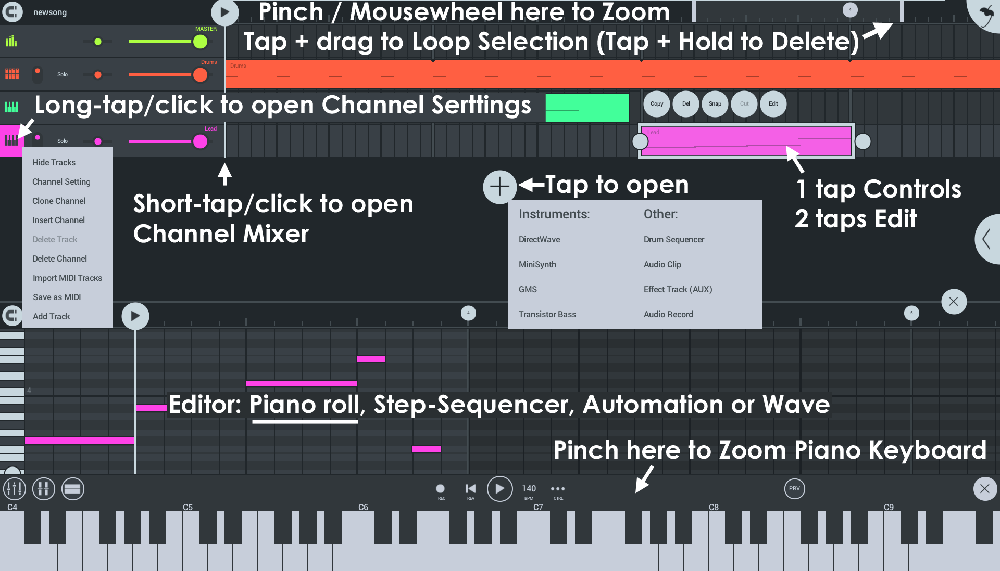
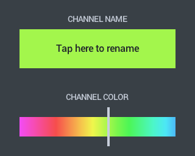
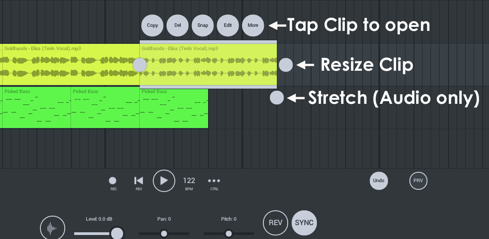
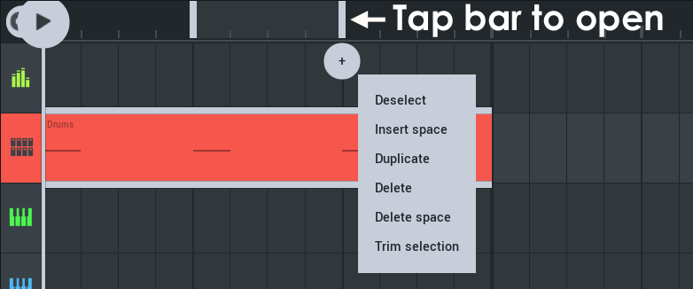
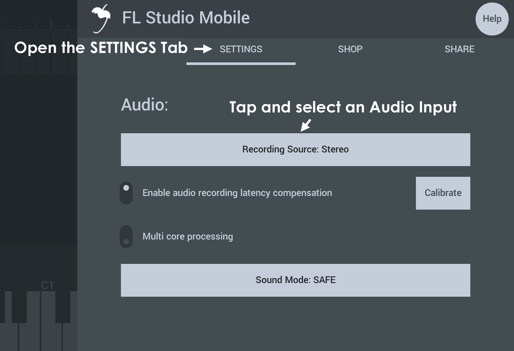
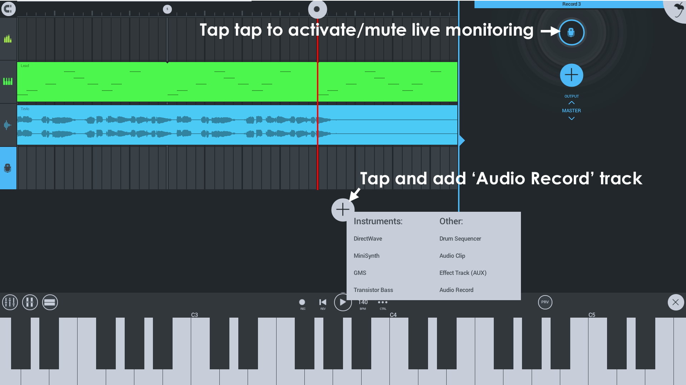
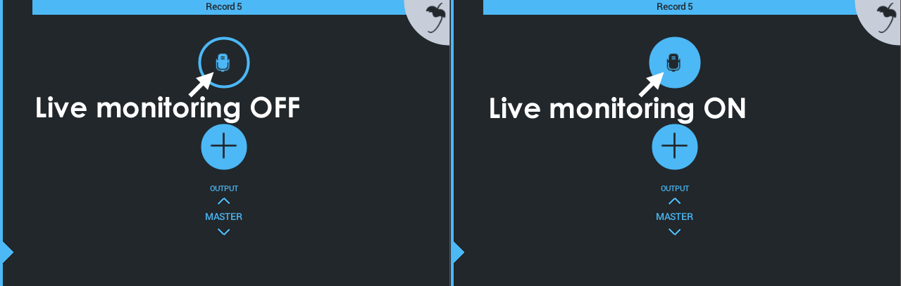
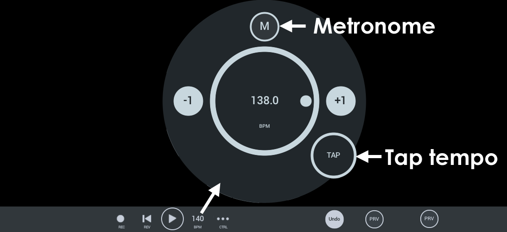

# FL Studio Mobile - Playlist

The playlist is the place to arrange and edit Note, Audio and Automation to create your song.

## Parameters

The FL Studio Mobile interface is designed for touch so uses tap-and-hold (right-click), short-tap and long-tap commands.

*   **Channel Menu** - Long tap (Click) the Track Icon to open the menu and select.  
    **NOTE:** The options visible will depend on the track type being used and the content on it.
    *   **Save Template** - This option is available for [Drum Channels][1] (Stepsequencer) and allows you to save the custom set of drums.
    *   **Channel Settings** - Change the **track name** by tapping on the name or slide the **color** selector to change the color of the track.
        
        
        
    *   **Hide/Show Tracks** - Hide/Show any Sub-tracks to the selected Channel.
    *   **Reverse sample** - Audio Clip tracks can be reversed.
    *   **Add Track** - Add a Sub-Track to the selected Channel.
    *   **Import Sample** (Windows only) - Opens a dialog to import samples from the device. After importing the sample, you will need to re-load it on the selected track.
    *   **Add StepSeq Track** - This option is available for [Drum Channels][1] (Stepsequencer) and allows you to create a normal Stepsequencer Sub-Track.
    *   **Add Notes Track** - This option is available for [Drum Channels][1] (Stepsequencer) and allows you to create a **note-style** Sub-Track. This treats steps like notes so you can extend durations by tapping on the step and dragging the right-side drag-handle and create complex timings such as triplets and 1/64th notes ([video tutorial here][2]). Note tracks are also the style created when you manually record into Stepsequencer tracks.
    *   **Delete Track** - Delete the selected Sub-Track from the selected Channel.
    *   **Delete Channel** - Deletes the Channel and any Sub-Tracks.
    *   **Import MIDI Tracks** - Import MIDI (.mid) files. See [My Files > My MIDI][3]. The Tracks will be added to the selected Channel.
    *   **Import Sample** - Load a sample from the file system available on your device.
    *   **Save as MIDI** - Saves the current Channel as a MIDI (.mid) file. See [My Files > My MIDI][3].
    *   **Sync All Samples** - Sets all Audio Clips to SYNC mode. This locks the sample to the project tempo, so pitch remains constant as BPM or length is changed.
        
*   **Track Mixer** - Short tap (Right-click) to open.
    
    
    
*   **Clip Controls** - One short tap to open.
    
    
    
    *   **Copy** - Copy the Clip. To place, long-tap where you would like to place and an option to **paste** will open.
    *   **Del** - Delete the Clip.
    *   **Snap** - Snap the Clip boundaries to the Grid. Snap options are on the upper-left of the Playlist (Magnet icon).
    *   **Edit** - Open the Clip Editor. You can also double-tap Clips to open Editors.
    *   **More** - Opens additional Clip options:
        *   **Cut** - Cut the Clip.
        *   **Combine** - When you have selected multiple (separate) Clips on the track, this will combine them into a single Clip.
        *   **Mute** - The Clip will be remain silent when played.
        *   **Unmute** - Play an muted Clip again.
        *   **Less** - Show the first batch of Clip Control menu items.
    *   **Resize Clip** - The center (height) handles on the ends of Audio and Pattern Clips allow you to resize the Clip (hold and drag). When the end of the data in the Clip has been reached, the Clip will Loop.
    *   **Stretch Clip** - Only available for Audio Clips. This allows you to Time Stretch the Audio Clip. When **SYNC** is selected the Pitch will remain constant. When it is deselected the Pitch will change with length.
*   **Clip Editor** - 2 taps to open. Depending on the Clip type this will open the Piano roll (note entry), Automation Clip editor, Wave editor or Stepsequencer.
    
    
    
*   **Time selection options** - After making a time-line selection there will be a (+) icon, tapping this opens a menu. If the (+) icon is not visible, tap one of the bars of the selection:
    
    
    
    *   **Deselect** - Remove time-line selection.
    *   **Insert space** - Insert time equal to the selection length. Clips straddling the selection, will be sliced at the start of the selection and moved to the right. Time will be added equivalent to the length of the selection.
    *   **Duplicate** - All Clips in the selection will be sliced at the selection boundaries and copied to the right.
    *   **Delete** - All Clips in the selection, will be sliced at the Clip boundaries and deleted.
    *   **Delete space** - All Clips in the selection, will be sliced at the Clip boundaries. Both Time and Clips will be deleted, Clips to the right will be moved left.
    *   **Trim selection** - Clips will be sliced at the selection boundaries and everything outside the selection will be deleted (Time and Clips).
    
    
    
*   **Add Track Button (+)** - Tap to open. Choose from:
    
    *   **DirectWave** - Sample player. From the Channel Rack tap the [plugin menu][4] to open the sample / preset browser.
    *   **Minisynth** - Realtime synthesizer.
    *   **GMS** (Groove Machine Synth) - Realtime synthesizer (Additional purchase required).
    *   **Transistor Bass** - 'TB-303 style' bass synthesizer (Additional purchase required).
    *   **Drum Sequencer** - [Stepsequencer][1] track.
    *   **Audio Clip** - Creates a Playlist track and adds a wave sample to the track. You will see a Browser after adding this track type. See [Your Files!][3] for info on adding custom samples and where the Browser looks for audio.
    *   **Effect Track (AUX)** - These are audio-only tracks designed to host FX plugins. Use the routing control at the bottom of [Channel Racks][5] and the [Drum Sampler > Sample Tab > AUX][6] control to send audio to an Effects Track (AUX).
    *   **Audio Record** - Creates a Playlist track dedicated to Audio Recording. See [Your Files!][3] for more information where your recordings are saved.

### Audio Recording

When recording audio from a microphone, make sure to **wear headphones** so audio from FL Studio Mobile isn't mixed in with the recorded source. **To set up for recording:**

1.  Check the **[SETTINGS > Audio >][7]** section for the correct Audio Input. This is usually set to Microphone (or 'Recording Source Stereo'). You only need change this control if you have more than one Microphone on your device, you are using a **USB audio interface** or there is no audio being recorded.  
    **NOTE:** In the case of Audio interfaces, you may need to test input options to find the correct one for your microphone or instrument (e.g. guitar) input you are using. **Windows App** users, see the NOTES at the bottom of this section.
    
    
    
2.  Tap the 'Add Track' icon and select '**Audio Record**'.
    
    
    
3.  [Calibrate the device][8] (optional) - This is normally done once and remembered. Some devices will need to perform a calibration each time the App is restarted. The purpose is to accurately align recorded audio with the Playlist.
4.  Optionally open the Channel Rack to access the **monitor control**. Tap the microphone icon to mute/activate the live audio monitoring.
    **OFF:** The input is recorded but not audible through FL Studio Mobile.  
    **ON:** The input is recorded and is also audible through FL Studio Mobile.
    
    
    
5.  Tap the 'Record' button and start recording.

**NOTES:** On the [SETTINGS][9] tab, there are options including '**Audio Input**', '**Enable count-in when recording**', '**Metronome level**' and '**Use 32 Bit format when rendering and recording audio**' that may be useful to you. Additionally '**Sound mode: FAST**' may improve the recording experience on some systems.  
For **Windows devices** you will need to set your **Settings > Sound > Input** to match any custom Audio Interface you are using, for it to be visible in FL Studio Mobile.

#### iOS Inter App Audio (IAA) and Audiobus

See the section on working with [IAA and Audiobus inputs/outputs][10].

### Transport Bar

*   **REC** - Arm for recording. Press play to start. You can also engage and disengage Recording on-the-fly.
*   **REV** - Revert, returns the playhead to the start of the Song.
*   **TMP** - Tempo controls:
    *   **Metronome** - Click track. The Metronome volume is set from the [Home > Settings][11] panel.
    *   **Set tempo** - Drag around the BPM dial, use the +1/-1 buttons or use Tap Tempo.
    *   **Tap tempo** - Tap in-time here to set the tempo to a real or imagined tempo.
*   **CTRL** - Link to CC, Unlink from CC or Create (automation) parameter track.
    
    **To create an Automation Clip/Track** - You can automate most movable control on FL Studio Mobile. All knobs and sliders. To manually create an automation clip for a target: Tweak the control you want to automate. Tap CTRL and choose Add Automation Track. .
    
    1.  Tweak/move the target control
    2.  Tap **CTRL**
    3.  Select '**Add Automation Track**'
    4.  Tap the Automation Track and add an empty Automation Clip
*   **Undo** - Undo the last action. Only visible when a change has been made to the project.
*   **Prv** (Preview) - Solo audio for the selected Track, Pattern or Audio Clip, depending on what is selected.

[1]: Editors.md#stepsequencer
[2]: Editors.md#stepsequencer_advanced
[3]: HomePanel.md#userdata
[4]: Rack.md#pluginmodule
[5]: Rack.md
[6]: Editors.md#drumtrack_tabs
[7]: HomePanel.md#audio
[8]: HomePanel.md#latency_compensation
[9]: HomePanel.md#settings
[10]: iOS_InterApp.md
[11]: HomePanel.md