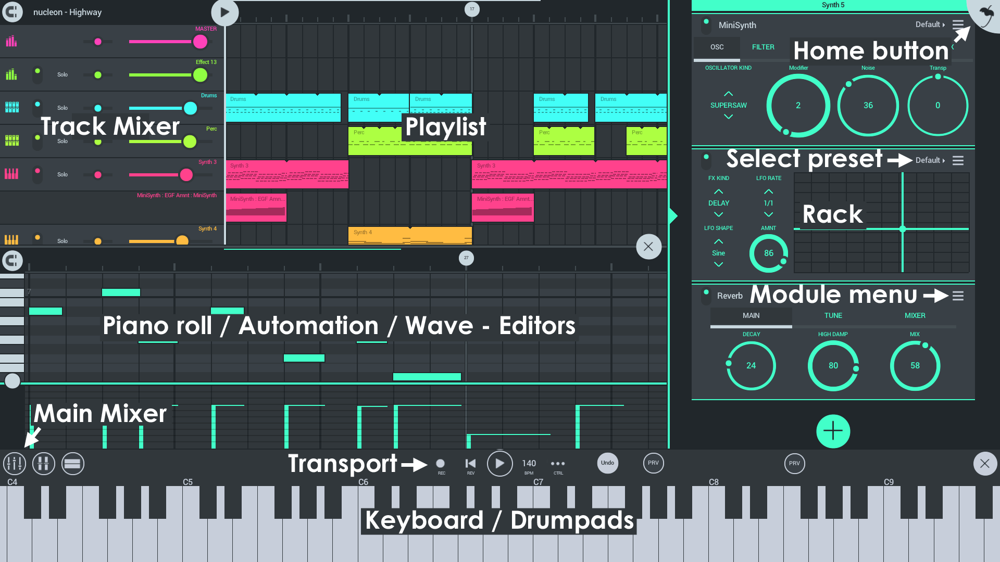

# FL Studio Mobile

**FL Studio Mobile 3** is a complete music production environment that works as an App on Android, iOS and Windows platforms plus as an [FL Studio](https://www.image-line.com/flstudio/) native plugin. In this way you can work on your mobile projects while on-the-go then continue in FL Studio and take them to the next level.

 29552167#37 

### Get it here

FL Studio Mobile works on **Android**, **iOS** and **Windows** (App and FL Studio plugin).

  

## Overview

FL Studio Mobile is designed to work on any screen from the size of a phone to TV sized touch-monitors. Each FL Studio Mobile 3 Playlist track has an associated 'Rack'. This can contain any number of instrument AND effects plugins. The only limit is your CPU power. There are now also automation-clip style tracks that can be edited just as you can now in FL Studio for the desktop.

### Instruments

- [**DirectWave**](FL Studio Mobile_Module_DirectWave.md) [**free**] - This is a sample player and is useful for traditional sounds such as **Piano**, **Orchestra**, **Guitar** etc. There are many included sample banks. Or you can purchase more from the [in-app shop](FL Studio Mobile_HomePanel.md#shop).
- [**MiniSynth**](FL Studio Mobile_Module_Minisynth.md) [**free**] - Is a fully featured **synthesizer** with a low processor overhead and great sound. There are 1000's of patches available for it on the user forums or you can create your own.
- [**GMS (Groove Machine Synth)**](FL Studio Mobile_Module_GMS.md) [in-App purchase] - Is a multitimbral hybrid **synthesizer** & FX channel from the FL Studio (PC), [Groove Machine plugin](https://www.image-line.com/support/FLHelp/html/plugins/GMS.htm).
- [**Transistor Bass**](FL Studio Mobile_Module_TransistorBass.md) [in-App purchase] - Transistor bass is a monophonic bass-line style **synthesizer** for creating resonant-style basslines and leads.

### Workspaces

- **[Home Button](FL Studio Mobile_HomePanel.md)** - Load and save, MIDI input/s, CPU/Audio settings, Metronome loudness and Shop.
- [**Playlist**](FL Studio Mobile_Playlist.md) - Arrange Note, [Automation](FL Studio Mobile_Editors.md#automationclip) and Audio Clips to create songs.
- [**Rack**](FL Studio Mobile_Rack.md) - Add instrument and effects.
- [**Main Mixer**](FL Studio Mobile_Mixer.md) - Adjust levels, panning and solo.
- [**Editors**](FL Studio Mobile_Editors.md) - Depending on the selected Clip in the Playlist. The appropriate editor will show here. Use the Piano roll, Automation and Wave editors.
- [**Keyboard, Drumpads & MIDI Controllers**](FL Studio Mobile_Controllers.md) - Depending on the track type, Drums or Notes, the appropriate controller will show here, keyboard or Drumpads.

### Registration, why it's important!

When you first tap **HELP > Users & Support forums**, we ask you to register your device to your Image-Line Account.

- You get posting / download access to the [FL Studio Mobile support forum](https://support.image-line.com/redirect/flmobile_forum) where you can get direct **Technical Support** (from the development team) and talk to other users.
- There are also lots of additional free samples, instruments and presets on the forum including: [DirectWave](https://forum.image-line.com/viewtopic.php?f=1964&t=78796), [MiniSynth](https://forum.image-line.com/viewtopic.php?f=1964&t=119657), [GMS](https://forum.image-line.com/viewtopic.php?f=1964&t=164423) and [Transistor Bass](https://forum.image-line.com/viewtopic.php?f=1964&t=164424).
- We unlock your content to use with the [FL Studio plugin version](https://support.image-line.com/redirect/flstudiomobile_plugin).

### Frequently Asked Questions

- **How do I save my project as an audio/music file?** - Use the **Save > MP3 or WAV** on the [Home Tab](FL Studio Mobile_HomePanel.md). Your audio file will end up in the FL Studio Mobile installation folder under **../My Tracks**. If your operating system supports it, you can also choose other save locations.
- **Where can I get technical support?** - Register FL Studio Mobile and visit the [FL Studio Mobile support forum](https://support.image-line.com/redirect/flmobile_forum).
- **How do I make feature requests and suggestions?** - Register FL Studio Mobile and visit the [FL Studio Mobile support forum](https://support.image-line.com/redirect/flmobile_forum).
- **How do I get the FL Studio Plugin version of the App?** - The [FL Studio Mobile FL plugin](FL Studio Mobile_FLStudioPlugin.md) is included from [FL Studio 12.4](https://www.image-line.com/downloads/flstudiodownload.html) onward. Check for updates to the plugin [here](https://support.image-line.com/redirect/flmobile_flplugin). You need to have a version equal to, or later than that. FL Studio for desktop includes Lifetime Free Updates, so after you buy it, you will always get the latest version for free. Just like an App!
