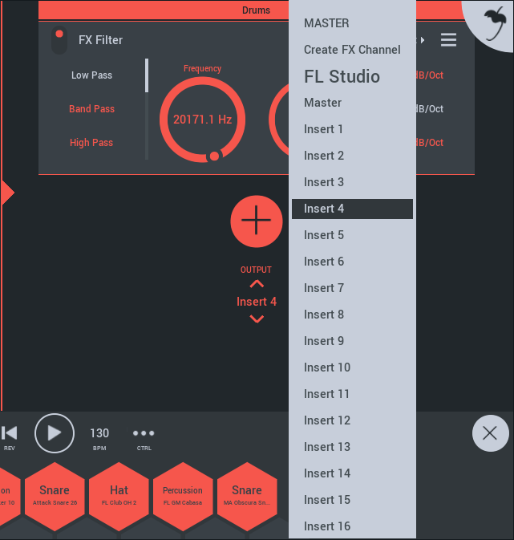

# Channel Rack

Each Playlist track has its own 'Channel Rack'. This holds the Instruments and Effect plugins for that Playlist Track. Rack modules stack and you can use both [instrument][1] AND [effects modules][2].

## Channel Rack

To open the Channel Rack, select the Track in the Playlist then tap the Channel Rack open control on the right side of the Playlist.

*   **Channels** - There are three main types of Playlist Channels, **Instrument** (the Channel Rack will hold both instruments and FX modules), **Audio** and **FX** (the Channel Rack for these last two holds only FX modules).
*   **Processing order** - The order of the instruments and effects in the rack determines processing order (top first, bottom last). For example; If you load DirectWave > Distortion > MiniSynth > Reverb. The Playlist Pattern Clips will play both DirectWave + MiniSynth together. However, DirectWave will pass through the Distortion + Reverb effects, while MiniSynth will have only Reverb effect.

You can also create FX Racks for grouped submixes. See [Audio Routing][3] below.

### Plugin Modules

Plugins have two menu items on the upper right, as shown below. The **left menu** allows you to open presets. The **right menu** allows you to reorder, copy and delete plugin modules.

To **copy and paste a module**, from one rack to another, open the Module menu, tap Copy, then select the new Rack and use the (+) button at the bottom and use Paste.

### Instrument Modules

There are 4 instruments and one drum sampler:

*   [DirectWave][4] - This is a multi-sample based player. It can load DirectWave (FL Studio PC format) .dwp files. This is also how you can access your purchased sample-based instruments and custom samples/instruments.
*   [MiniSynth][5] - MiniSynth is a fully featured synthesizer with a low processor overhead and great sound. Load the presets or create your own sounds from scratch. There are 6 tabs covering the synthesizer controls.
*   [GMS (Groove Machine Synth)][6] \[demo\] - Additional purchase, see the Shop page. Groove Machine Synth is a multitimbral hybrid synthesizer & FX channel from the FL Studio (PC), [Groove Machine plugin][7].
*   [Transistor Bass][8] \[demo\] - Additional purchase, see the Shop page. Transistor bass is a monophonic bass-line style synth for creating resonant-style basslines and leads.
*   Drum Sampler - While not an instrument that you can load in the rack, there is a Drum Sampler Playlist Track type. This holds the Step Sequencer and a multi-channel drum sample player.

### Effect Modules

There are many effects available to you.  
NOTE: To save CPU load, and where you want the effect to apply to all tracks, rather than putting the same effect on every track, add a single effect to the Master FX track. All audio passes though this final track.

*   [Autoduck][9] - Ducking is a form of automated volume dipping. Use this to create 'sidechain' style effects.
*   [Chorus][10] - Chorus creates a thicker/lusher sound by detuning multiple voices within the sound.
*   [Compressor][11] - Compression is a form of (very fast) automated volume control that reduces the difference between loud and soft sounds. That is, the difference in level between the peaks and troughs of the audio waveform. When the input signal exceeds the threshold the gain, or rate at which the signal level is allowed to increase, is reduced. In other words, the waveform amplitude is 'compressed'.
*   [Distortion][12] - The amplifier simulates distortion type 'overdrive' typical of guitar amplifiers. It allows high-overdrive even if a track's volume is quiet.
*   [Equalizer (Parametric)][13] - Equalizing is the process of increasing or decreasing the loudness of specific frequencies. An advanced 4-Band parametric equalizer. The Band type (shape), center frequency and width of each Band are fully adjustable. You can choose from: High Shelf, Low Shelf and Peaking.
*   [Filter][14] - Filters are similar to Equalizers, however they are designed more for creative (automated) effects. Sweeping a filter-cutoff frequency is a very common technique used in electronic dance music (EDM).
*   [Flanger][15] - Similar to the Chorus effect Flanging allows you to enrich the stereo panorama of your mix.
*   [Graphic EQ][16] - Equalizing is the process of increasing or decreasing the loudness of specific frequencies. This is an 8-band equalizer with sliders set to convenient frequency ranges for general equalizing duties.
*   [IAA/Audiobus][17] - Input/Output module for working with Inter App Audio and Audiobus (iOS only).
*   [Leveller][18] - A precise volume control. Use leveller to monitor levels and to make precise changes to level and stereo panning.
*   [Limiter][19] - Limiting is a form of heavy compression (generally used to describe compression ratios greater than 10:1). The purpose is to 'limit' the output level to a set maximum level, usually 0 dB, to avoid clipping in a final mix down. The Limiter can be used to maximize the level of a track dramatically, without introducing noticeable distortion and so limiting is a favorite effect used in mastering.
*   [Multi FX][20] - Combines Delay, Reeverb, Low Pass Filter, High-Pass Filter, Flanger, Phaser, Panner and Vox filter. These are controlled by and X/Y pad. Useful for combined-effects and automation.
*   [Phaser][21] - Phasing modulates the relative phase of the dual-voice oscillators. Oscillator voices are delayed by different amounts, causing a moving frequency cancellation effect that you will recognize even if you don't really understand how it works ;)
*   [Reverb][22] - Reverb simulates a room of a certain type (Hall/Canyon/Room) and size.
*   [Stereoizer][23] - Stereoizer creates stereo effects from mono sources. Use it to create a 'wider' sounding mix.
*   [Tape Delay][24] - Delay is an echo style effect and is particularly effective for out-of-tempo experimental delay sounds.
*   [Trance Delay][25] - Delay is an echo style effect and is particularly effective when played in sync with the main tempo of the track.

### Copying Modules

*   **Paste** - Adds the module in the copy/paste buffer including the current settings. Active when you have used the **Copy** command from a Module menu (shown in the **Plugin Modules** section above).

### Audio Routing

By default all Channel Racks are routed to the **Master Mixer FX Track**. Use the Output control, at the bottom of Channel Racks, to send audio from the selected Channel to any FX Channel in the project. You can also create new FX Channels. FX Channels are **designed to process audio**, so only FX modules will be available to add to these Channel Racks from the (+) button. Use FX Channels to create sub-mixes for grouped FX processing.

Tap the control below the **Add Module** button (+), to access:

*   **Create FX Channel** - Adds an **FX Channel** to the Playlist. Load FX modules on an FX Channel, and route multiple tracks to it for group FX processing.
*   **Send to** - Select from an existing list of FX Channels.  
    **NOTE:** The **Master** is always available, as it is added to all projects, by design. The example above shows two FX channels have been added to the project (they can be renamed by **long-tapping the Track Header > Channel Settings > and tap on the rename area**.

**NOTE:** You can chain FX Channels by sending from one to the next.

#### FL Studio Plugin Version Routing

When using FL Studio Mobile as a plugin in the desktop version of FL Studio, you can also choose to send any Racks output to any FL Studio Mixer track.

[1]: #instrumentmodule
[2]: #effectmodule
[3]: #flm_routing
[4]: FL%20Studio%20Mobile_Module_DirectWave.md
[5]: FL%20Studio%20Mobile_Module_Minisynth.md
[6]: FL%20Studio%20Mobile_Module_GMS.md
[7]: https://www.image-line.com/support/FLHelp/html/plugins/GMS.htm
[8]: FL%20Studio%20Mobile_Module_TransistorBass.md
[9]: FL%20Studio%20Mobile_Module_Autoduck.md
[10]: FL%20Studio%20Mobile_Module_Chorus.md
[11]: FL%20Studio%20Mobile_Module_Compressor.md
[12]: FL%20Studio%20Mobile_Module_Distortion.md
[13]: FL%20Studio%20Mobile_Module_ParametricEQ.md
[14]: FL%20Studio%20Mobile_Module_Filter.md
[15]: FL%20Studio%20Mobile_Module_Flanger.md
[16]: FL%20Studio%20Mobile_Module_GraphicEQ.md
[17]: FL%20Studio%20Mobile_iOS_InterApp.md
[18]: FL%20Studio%20Mobile_Module_Leveller.md
[19]: FL%20Studio%20Mobile_Module_Limiter.md
[20]: FL%20Studio%20Mobile_Module_MultiFX.md
[21]: FL%20Studio%20Mobile_Module_Phaser.md
[22]: FL%20Studio%20Mobile_Module_Reverb.md
[23]: FL%20Studio%20Mobile_Module_Stereoizer.md
[24]: FL%20Studio%20Mobile_Module_TapeDelay.md
[25]: FL%20Studio%20Mobile_Module_TranceDelay.md