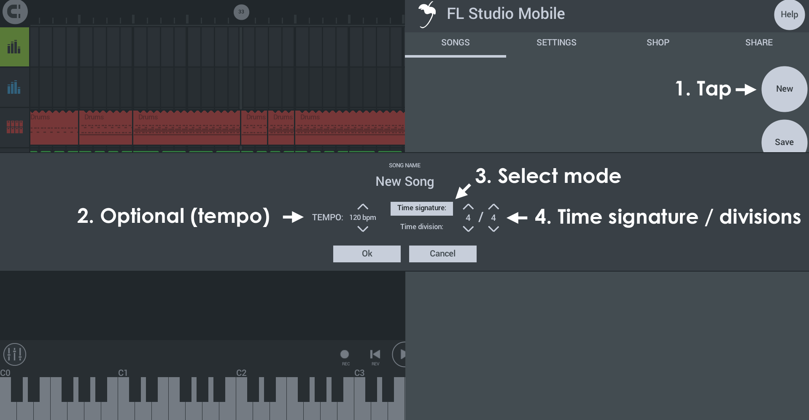
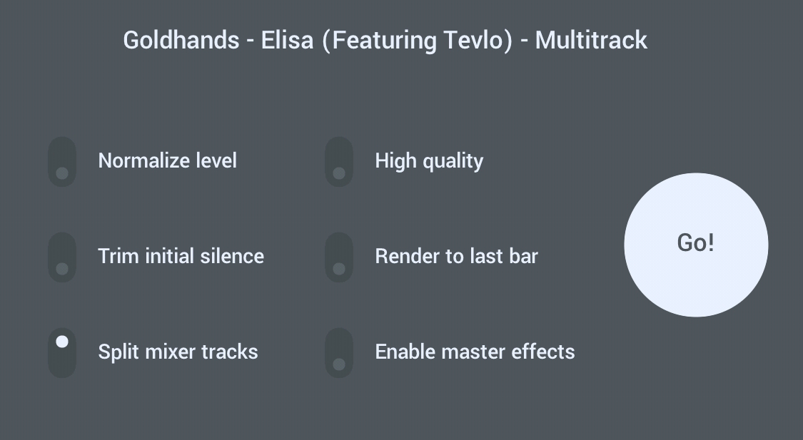
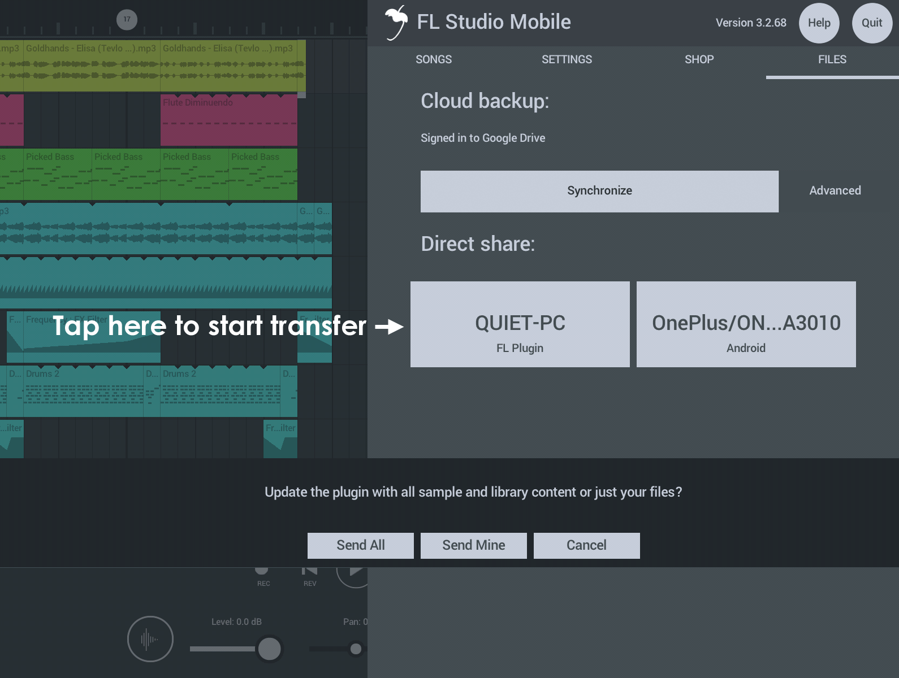
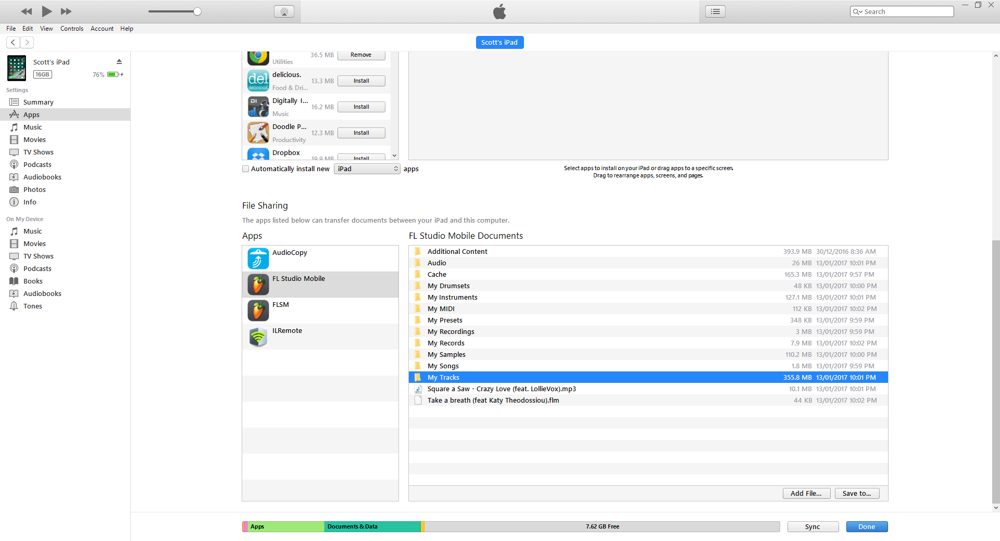

# FL Studio Mobile - 主页面板

主页面板包含 SONGS、SETTING、SHOP 和 SHARE 这几个选项组。

## 参数

点击 **主页按钮（右上角LOGO）** 可访问一下内容：

**注意：**并非所有功能在所有操作系统上都可用。

### HELP（帮助按钮）

帮助按钮是您的朋友！ 在它下面您可以找到……

*   **Manual（手册）**——你这在阅读。
*   **Video Tutorials（视频教程）**——丰富的 [FL Studio Mobile 视频教程](https://www.bilibili.com/video/av29552167).
*   **Users & Support Forums（用户与论坛）**——[用户论坛](http://support.image-line.com/redirect/flmobile_forum) 是询问「操作方法」问题，进行功能请求或报告错误的好地方。 如果某事不起作用，则报告它是修复问题的最快方法。
*   **Play Tutorial（播放教程）**——播放 [入门视频教程](https://www.bilibili.com/video/av80167389).
*   **Register at Image-Line（注册到服务器）**——创建的我们的一个 Image-Line 账号。 这将使您可以访问 [用户论坛](http://support.image-line.com/redirect/flmobile_forum)。

### SONGS（歌曲）

**Songs**——加载或保存 FL Studio Mobile 工程和 MIDI 文件。

*   **New**——打开新工程模板
    
    
    
    **开始一个新的项目……**
    
    1.  **New**——打开新的对话框
    2.  **Tempo**——从常见的速度范围中进行选择。你可以稍后更改此设置，也可以从下面控制器上的 [BPM 控件](FL%20Studio%20Mobile_Playlist.htm#flmobile_transportbar) 设置准确的速度。
    3.  **Mode**——您可以将 FL Studio mobile 中的时间标尺设置为以下两种模式之一：
        
        *   **Time signature**（拍号，传统）——选择 **节拍**/**节拍值**。步进音序器将根据节拍值显示 1/16 音符。
        *   **Time division**（时间划分，高级）——设置 **每个节拍的步数** 和 **每个小节的节拍**。 步进音序器将显示选定的每个节拍的步数。
        
        **注意：**只能在创建项目时设置节拍和时间划分。 这些内容以后将无法更改。
        
    4. **OK**——使用所选设置启动新项目。
       **注意：**每个项目只能设置一个时间拍号。 您不能更改现有项目的拍号。
    
*   **Save**——保存当前工程。**注意：**点击 **SEND** 可让您通过电子邮件和文件共享应用程序发送内容。选项包括：
    
    
    
    **正在保存或发送文件……**
    
    1.  **SONGS Tab > Save（保存）**——从 SONGS 选项卡中选择 **保存**。
    2.  **Rename file（重命名）**（可选）——如果要重命名项目，请点击此处并输入新名称。
    3.  **Select format（选择格式）**——选择保存格式。FLM 是工程文件。MIDI 是音符数据。WAV、FLAC、MP3和AAC是音频格式。
    4.  **SEND（发送）**（可选）——这是保存到设备的另一种方法。点击此处可选择电子邮件和任何其他外部位置，这些位置可通过应用程序共享您设备上的文件。**注意：**这与 [SHARE](#share（共享）) 选项卡不同，后者允许您在 FL Studio Mobile 安装之间直接共享文件。
    5.  **SAVE（保存）**——这将保存到默认的 FL Studio Mobile 用户数据文件夹。保存音频格式时，你将看到以下选项：
        
        
        
        *   **Normalize level（标准化级别）**——最大化音量，使最大的峰值达到 100％ 的音量。
        *   **Trim initial silence（去除初始静音）**——从渲染开始时消除静音。
        *   **High quality（高质量）**——设置最高质量的音频。操作取决于渲染格式——WAV 32 位（HQ）/ 16 位（关）。FLAC 24 位（HQ）/ 16 位（关），MP3 320 kbps（HQ）/ 192（关）。 AAC 320 kbps（HQ）/ 192（关）。
        *   **Render to last bar（渲染到最后一个小节）**——渲染在最后一个小节的末尾停止。 这样可以避免音频文件上长尾巴，而效果可能会持续。
*   **File Name（文件名）**——点击来编辑文件名。
*   **Save format（保存格式）**——选择要保存的文件类型。
    
    *   **FLM**——FL Studio Mobile 工程格式（在文件浏览器中查看时，扩展名为 **.flm**）
    *   **MIDI**——MIDI是一种数据格式（在文件浏览器中查看时，扩展名为 **.mid**），用于与其他 DAW 软件共享FL Studio Mobile 项目数据（注释和控制信息）。**注意：**此选项将项目的前16个音轨保存到单个MIDI文件中。 如果你有 16 个以上的音轨，则可以重新排列音轨顺序并进行多次保存，或者将每个音轨 [另存为 MIDI](FL%20Studio%20Mobile_Playlist.htm#channel_menu).
    *   **WAV (audio)**——最高质量，文件大。Wave 是一种无损的音频格式，是在生产环境中处理音频的首选格式（与 FLAC 一起）。文件是 16 位 WAV 格式（在文件浏览器中查看时，扩展名为 **.wav**），除非您在保存弹出选项中设置了「高质量」（请参见上文），然后才是 32 位格式。
    *   **FLAC (audio)**——免费的无损音频编解码器。在将所有音频信息保留在编码波形中的方式类似于 WAV 格式。FLAC 的另一个好处是可以大大减小文件大小。 FLAC 文件通常比等效的 WAV 文件小 20％ 至 30％，同时保留原始数据的位完美副本。 保存弹出菜单中的「高质量」（参见上文），每个采样在 16 至 24 位之间。
    *   **MP3 (audio)**——质量较差，文件较小。文件比特率为 192 或 320 kbps（HQ）（在文件浏览器中查看时，扩展名为 **.mp3**）。
    *   **AAC (audio)**——质量较差，文件较小。文件比特率为 192 或 320 kbps（HQ）（在文件浏览器中查看时，扩展名为 **.acc**）。
    
    **提示：**在 FL Studio Mobile 和 [其他 DAW 软件](FL Studio Mobile_FLStudioPlugin.htm) 里重用则使用 **WAV**。使用 **MP3** 来发布和倾听音乐。
    
*   **SEND（发送）**——显示的位置将取决于您的设备和操作系统（它们会在您设置 **「SEND 发送」** 后显示，然后点击「SAVE 保存」）。例如包括：**电子邮件**、**在线云存储** 和 **内部文件夹**。

**注意：** 有关 **高级文件共享** 请参见 [你的文件（工程、WAV、MP3、MIDI 文件在哪里？）](#查找你的文件)部分。

### SETTINGS（设置）

**Settings**——选择 MIDI 输入，CPU、音频的设置和节拍器响度。

#### MIDI Device（MIDI 设备）

*   **MIDI Input（MIDI 输入）**——当检测到 [外部 MIDI 设备](FL%20Studio%20Mobile_Controllers.htm#flm_externalcontrollers) 时，您可以使用此控件将其设置为播放选定的播放列表轨道。
*   **Enable MIDI over Bluetooth LE（通过低功耗蓝牙启动 MIDI）**——选择此项以连接蓝牙MIDI设备。在 **Android** 上，这将打开 **位置访问权限**。[Google 要求](https://developer.android.com/guide/topics/connectivity/bluetooth-le.html#permissions) 这样做（请参阅 「LE Beacons note」），因为可以从附近的蓝牙设备猜测到您的位置。我们仅将蓝牙用于 MIDI 键盘，并且请勿尝试猜测您的位置或将任何数据发送到我们的服务器。

**注意：**有关使用MIDI控制器的更多信息，请参见 [此处](FL%20Studio%20Mobile_Controllers.htm#flm_externalcontrollers)。

#### Application（应用）

*   **Enable count-in when recording（录制时启用计数）**——计数完开始录制。
*   **Display names of the keys on the keyboard（显示钢琴键名）**——在八度音阶名称之间添加所有白色音符（A、B、C、D、E、F 和 G）的名称。
*   **Metronome level（节拍器响度）**——用它来调节节拍器的相对音量。可以从「控制器」**TMP** 按钮访问节拍器。
*   **Normalize rendered songs（标准化渲染的歌曲）**——通过增加波形的振幅使歌曲更响亮，从而使最响亮的采样处于最大可能的水平。标准化确定将使最大的波形峰值达到100％的乘法因子，然后将波形中的所有样本乘以该值，然后重新缩放它们。
*   **Control Sizing（控件大小）**——更改控件的大小，使其更适合您的用例或设备。
    **注意：**必须重新启动 FL Studio Mobile 才能使此设置生效。
    **故障检测：**如果缩放选项使UI无法使用，请删除  [FLM User Files](#查找你的文件) 下的 **uiscale** 文件。
    
*   **Enable sharing（启用共享）**——这将启用 [SHARE（共享）](#share（共享）) 选项卡选项。通常，您可以将其保留。但这意味着。当它们出现时，它们将作为数据的目标选项出现。
    **注意：**当连接到桌面操作系统（Windows、OS X、macOS）时，您可能会看到防火墙的安全弹出窗口。 允许FL Studio Mobile访问。

#### Audio（音频）

* **Audio Input（音频输入）**（默认显示麦克风）——当多个输入可用时，选择音频输入。在带有立体声麦克风的移动设备上，您将看到 **Recording Source: Stereo（录制源：立体声）**和选择左声道或右声道（麦克风）的选项。当一个麦克风不如另一个麦克风时，有时这是必要的。如果将麦克风设计为主要用于消除噪音并且不捕获语音的情况，则会发生这种情况。连接 **音频接口**（在移动设备上，[通过适配器](../assets/home/adapters.jpg)）后，将提供其他输入选项。如果不能正确地被标识，那可能需要逐个尝试来找到所需的输入。iOS 上的输入选项还包括 [Audiobus 输入](FL Studio Mobile_iOS_InterApp.htm)。

*   **Enable audio recording latency compensation（启用录音延迟补偿）**——确保录制的音频与播放列表正确对齐。例如，你正在录制自己演奏的 FL Studio Mobile 击鼓音轨，那么延迟校准将确保击鼓声音从麦克风录制到的并与击鼓紧有序的紧密对齐。这是必要的，因为在移动设备上，播放列表中生成声音的时间到扬声器发出声音之间通常存在明显的延迟。该设备的 **音频延迟** 通常在 40 到 200 毫秒之间。如果您正在用实时输出进行唱歌或演奏，实际上你的行为是在设备声音事件的 40 到 200 毫秒 **之后** 发生的。如果没有延迟补偿，实时输出的录音将滞后于内部排序。补偿时，删除录音开始的一段音频，这段音频就等于声音往返的延迟。这是校准设备延迟的最准确方法。
    **Calibrate（校准）** - 要执行校准时，FL Studio Mobile 必须能够录制到自己的输出。该过程通过录制一声蜂鸣音来计算录音从输出到输入的延迟。
    
    *   **使用内置麦克风**
        1. 找一个安静的地方。
        2. 断开耳机。
        3. 将音量调高到 80 ~ 100％ 左右。
        4. 点击 **Calibrate**。
    *   **使用内置麦克风**
        1. 找一个安静的地方。
        2. 将音量调高到 50％ 左右。
        3. 把麦克风靠近扬声器或靠在耳机扬声器上。
        4. 点击 **Calibrate**。

    **如果校准失败**——这通常是没有检测到校准的蜂鸣声。一般，你可以：
    1. 把音量调大。
    2. 确保在校准时不要移动、撞击或摩擦设备。
    3. 确保你知道麦克风在哪里，并且可以清晰地接收音频。
    4. 点击 「Calibrate」校准时，请确保它尽可能安静。
    5. **音频接口**——确保 **输入选择器** 与您使用的麦克风匹配。将麦克风放在耳机上。
    
* **Use 32 Bit format when rendering and recording audio（渲染和录制音频时使用 32 位格式）**——对于所有创建的 **.wav** 格式的音频文件，从 16 位 wav 切换到 32 位 wav 文件。 
  **注意：**在其他应用程序（例如 PC 版 FL Studio）中对音频进行后期处理时，此格式可保留最高质量。仅在有特殊情况下才使用32位。如果不确定，请使用 16 位。32 位 wav 在许多消费者级别的媒体播放器中不能使用。

* **Enable background audio（启用后台播放）**(iOS)——最小化时允许应用播放。

*   **Sound mode（声音模式）**(Android)——这是一个音频引擎选项，可减少音频故障和炸裂：
    
    *   **Fast**——可设置设备最低延迟。延迟是敲击键盘和听到声音之间的延迟。
    *   **Safe**——可以减少音频故障，但代价是增加延迟。
    *   **Ultrasafe**——延迟最大，但与设备的兼容性最广。
    
    **故障检测：**有两个与音频性能有关的选项：**Multi core processing（多核处理）** 和 **Sound mode（声音模式）**。这里给出 6 种可能的组合。把它们都试一试，看看有没有什么组合能解决你的问题：开/FAST、开/SAFE、开/ULTRASAFE、关/FAST、关/SAFE、关/ULTRASAFE。
    
*   **Multi core processing（多核处理）**——这是一个CPU选项，可减少音频故障或炸裂。实际上，根据所使用的设备，多核开启可能比关闭更糟。试试这两个状态。

### SHOP（商店）

**Shop**——您可以从此选项卡下载免费内容或购买其他内容。

*   **To purchase content（购买内容）**——点击 **Buy（购买）**按钮，然后通过应用商店完成交易。
*   **Restore purchases（恢复购买）**——如果你已经购买了内容，然后又在新设备上重新安装了FL Studio Mobile（或在同一设备上删除并将其安装后），则 **SHOP（商店）**选项卡将显示 **RESTORE（恢复）**按钮。轻按此按钮可以恢复您的购买。前提是你登录了购买应用程序的同一个应用商店账户。对于 Image-Line 提供的产品，如果你已经用你的 Image-Line 账户注册了你的设备，当你在设备上重新安装 FL Studio Mobile 时，点击 **Users & support forum** 按钮，然后重新注册你的设备到你的Image-Line账户，这个 **内容将被解锁**。

**注意：**应用内购买（例如 FL Studio Mobile 本身）不可在操作系统（Android、iOS和Windows）之间转移。有关为什么这样做的更多详细信息，请参见 [此知识库文章](https://support.image-line.com/knowledgebase/base.php?ans=497)。

### SHARE（共享）

在安装 FL Studio Mobile 的设备之间共享/同步文件

**Share**——您可以在运行 FL Studio mobile 的移动设备之间共享项目相关文件。当您的设备[连接到同一网络（包括WiFi）](FL%20Studio%20Mobile_WiFi.md)时，选择目标设备接收「你的文件」，即「FLM User Files」文件夹中的所有内容。通过此页面，您可以通过网络上在所有检测到的 Android、iOS 和 Windows（应用程序 和 FL 插件）设备上的 FL Studio Mobile 之间同步项目。
**注意：**第一次使用计算机执行此操作时，可能会看到 **防火墙弹出的安全消息**。允许 FL Studio Mobile 访问你的网络。**分享方式：**

https://www.bilibili.com/video/av29552167?p=3

1.  确保您在设备上使用的是最新版本的 FL Studio Mobile，并且具有 [最新的FL Studio插件](http://support.image-line.com/redirect/flmobile_flplugin)。
2.  将您的PC和或任何移动设备连接到同一个网络。通常情况下是通过 **Wi-Fi** 连接，但如果你同时使用 Wi-Fi 和 **以太网** 连接也可以。重要的一点就是 **所有设备都得连接到同一个网络**。
3.  在 PC 和移动设备上打开 FL Studio Mobile。
4.  在 PC 和移动设备上，选择 **SHARE（共享）** 选项卡。
    **注意：**第一次使用计算机执行此操作时，可能会看到 **防火墙弹出的安全消息**。允许 FL Studio Mobile 访问你的网络。
5.  在 **SHARE（共享）**选项卡上，您应该在设备列表上看到其他 FL Studio Mobile 的实例。**从** 您正在使用的设备共享 **到** 您选择的设备。
6.  点击一个设备，**您的文件**（请参阅下文）将被传输到该设备上。
7.  您将需要重新启动目标的 FL Studio Mobile 实例，来查看在启动时扫描的新数据。
8.  
    创建一个「我的文件」的快捷方式到你的电脑上，然后你可以手动复制文件进出这个位置，然后使用「共享」发送到你的移动设备，或者在共享到计算机后获取这些文件，非常简单！

**重要提示：**首次使用 **FL Studio 插件版本** 时，应将所有库内容 **Send All（全部发送）**给它。默认情况下，插件版本仅附带有限的音色库，因此您需要使用移动版的完整库来更新它。如果您不这样做，则工程将在插件版上缺少音色。这可能需要几分钟才能完成。

## 管理用户文件

此部分与内部文件浏览器有关，该浏览器在您选择「预设」或「添加音频片段」时打开。此处的选项 **仅适用于用户文件**。它们不适用于厂家安装的内容。

#### 处理文件

1.  点击「Select」打开文件管理器选项。
2.  点击右侧小小的选择按钮来选择你要管理的文件。
3.  选择您要对文件执行的选项/操作。

#### 选项

*   **All（全选）**——选择全部文件。
*   **Fold（折叠）**——创建一个文件夹并将所选文件移动到该文件夹。
    **注意：**您必须选择文件才能创建文件夹。
*   **Delete（删除）**——删除选中的文件。
*   **Cut（剪切）**——选择准备移动到另一个位置的文件（粘贴）。
*   **Paste（粘贴）**——粘贴「Cut」剪切文件。
*   **Export（导出）**——使用系统提供的共享选项导出文件。
*   **Wave**（仅 iOS 可用）——音频黏贴。

## 查找你的文件

由于移动操作系统（Android、iOS 和 Windows UWP）或多或少会妨碍应用程序轻松访问内部文件夹，因此将移动设备用作为创作工具可能会令人失望。[下面提供](#查找你的文件_access) 了关于操作系统如何访问这些文件夹的特别说明。在 FL Studio Mobile 文件夹下，您可以找到以下子文件夹。最初，这些文件夹为空，用于存储您的数据：

**FL Studio Mobile 子文件夹**

*   **My Drum templates**——鼓模板是组成鼓点的声音集合。这不是鼓的采样数据，而是将采样加载到鼓点中的预置数据。
* **My Instruments**——将 **[DirectWave](FL%20Studio%20Mobile_Module_DirectWave.htm) 程序 (.dwp)** 乐器文件放在这里，包括采样子文件夹和 FLM2 的旧格式 (**.instr**)。你可以直接从 [FL Studio (PC 版)](http://www.image-line.com/flstudio/) > [DirectWave](https://www.image-line.com/support/flstudio_online_manual/html/plugins/DirectWave.htm) (插件) > [PROGRAM > 右击程序标签](https://www.image-line.com/support/FLHelp/html/plugins/Directwave_zonewindow.htm) 并选择 **Save program** 导出 .dwp 和 .instr。
*   **My MIDI**——包含所有 MIDI 格式文件 **(.mid)**。这些将显示在 [SONGS 菜单](#songs) 和 [通道菜单](FL%20Studio%20Mobile_Playlist.htm#channel_menu)（「Import MIDI Tracks（导入MIIDI 音轨）」和「Save as MIDI（另存为 MIDI）」） 上。
* **My Presets**——此文件夹包含所有插件预设（乐器和效果）。没有子文件夹，因为预置包含预置中的元数据，因此 FL Studio Mobile 将只在您打开加载它们的插件里显示兼容的预置。例如，MiniSynth（迷你合成器 ）**.flms**，其他预置文件 **.flmpst** 包括：GMS（合成器）、Transistor Bass（贝斯合成器）和 FX Modules（效果模块）。
*   **My Recordings**——在 FL Studio Mobile 中进行的录音。WAV（未压缩格式，16、24 或 32 位）。见 **说明**。
*   **My Samples**——你想要的导入的任何一个镜头、采样、声响。WAV（未压缩格式，16、24 或 32 位）或 MP3。见 **说明**。
*   **My Songs**——工程文件。它们显示在 **Home Page > SONGS** 选项卡上.
*   **My Tracks**——这些音频文件是在渲染工程时创建的。如果要重用 FL Studio Mobile 中的轨道，请确保渲染为 **无损**（WAV）或 MP3 格式（创建要加载的「波形」类型的新播放列表轨道）。**压缩**（AAC 格式）文件不会显示在 FL Studio Mobile 中使用。 这些将在您的媒体播放器中播放。
    
    **节省 CPU：** 您可以将任何播放列表的轨道转换为音频，方法是让其独奏，并点击 **Home page > SONGS > SAVE** 将其保存为未压缩（WAV）格式。然后使用 **+（添加轨道）按钮 > Audio Clip（音频片段）**选项（找到保存的文件并加载）将其重新加载到播放列表中。乐句和完整的歌曲使用「My Tracks」。

**说明：**

1.  **添加新样本后，必须重新启动 FL Studio Mobile**，以便扫描并可供使用。
2.  FL Studio Mobile 加载采样数据的位置——[Drum Sampler（鼓采样器）](FL%20Studio%20Mobile_Editors.htm#stepsequencer)**、DirectWave** 和 **Audio 音频片段** 将扫描 **My Recordings**、**My Samples** 和 **My Tracks** 中的 (未压缩, 16、24 或 32 位) 和 MP3 (压缩) 数据并将其作为加载选项显示。因此，您还可以将 WAV/MP3 文件复制到这些位置中的任何一个。为了使事情井井有条，请对已调和未调的乐器/打击乐器样本使用「My Samples」,人声和乐器采样使用「My Recordings」「My Tracks」。

### 访问、导出和导入文件（WAV、MP3、MID、FLM 等）

本节介绍如何在每个受支持的系统平台上访问数据。这样，您就可以上传和下载 **自定义采样**、**乐器**、**预设**、**音乐** 和上面使用的任何其他文件。

#### 所有操作系统：使用 SHARE

If you have access to a Desktop PC, by far, the easiest method is to use [SHARE with the FL Studio Plugin](#share（共享）) TO and FROM the Mobile Device. In this case, add content to the FL Studio Mobile plugin folder on your PC, then SHARE to the mobile device. Or SHARE from the device to your PC. Alternatively, proceed as follows:

#### Android 文件管理

Android允许直接访问内部文件夹，主要有两个选项：

1.  使用 **USB 数据线** 将设备连接到计算机。然后将设备设置为在 **数据传输** 模式。现在，您应该具有对数据文件夹的拖放访问权限。您将需要找到 **FLM User Files** 文件夹。 这通常在主存储的根目录/顶部。
    
    
    
2.  **或者** 使用 [AirDroid](http://play.google.com/store/apps/details?id=com.sand.airdroid)，它将允许您使用 **网页浏览器** 访问任何 Android 设备上的文件夹和文件（在Windows和Mac上均可使用）。如果您在 Android 设备上进行内部操作，[Total Commander](http://play.google.com/store/apps/details?id=com.ghisler.android.TotalCommander) 将允许您在设备上的文件夹之间复制和粘贴文件。还有许多可用于跨网络工作的 [插件](http://www.ghisler.com/androidplugins/googleplay/)，例如 [LAN plugin](https://play.google.com/store/apps/details?id=com.ghisler.tcplugins.LAN)。
    
    
    

#### Apple iOS 文件管理

有以下方法可用：

1.  **系统导入**——iOS将识别电子邮件，云存储等中与 FL Studio Mobile 关联的大多数文件类型（.flm、.mid、.flmpst、.flms、.wav、.mp3），并允许您使用 FL Studio Mobile 打开它们。如您的电子邮件或云存储应用程序中所示，**长按附件或文件**，然后从弹出选项中选择以 **FL Studio Mobile** 打开该文件。
    
    
    
    当 FL Studio Mobile 启动时，文件将被移动到应用程序中的相应文件夹。此方法有效，一次仅一个文件。
    
    
    
2.  **iTunes 导入/导出**——使用iTunes将iOS设备连接到计算机。同步并选择 FL Studio Mobile 3 后，您将可以访问 **FLM User Files** 文件夹。您可以通过iTunes将这些文件夹完整地从 FL Studio Mobile 复制到您的计算机（您必须选择文件和/或文件夹，然后使用iTunes中的「**保存到…**」）。这将使您可以将文件和文件夹发送到计算机上。您无法在iTunes中查看这些文件夹。
    
    要 **上传所有文件类型**（.flm，.mid，.flmpst，.flms，.wav，.mp3等）到 FL Studio Mobile，请使用「**添加文件…**」按钮，以便将文件添加到 FL Studio Mobile 的根文件夹。下次重新启动应用程序时，这些内容将自动显示在 FL Studio Mobile 中的 **My Samples**、**My SONGS** 和 FL Studio Mobile 中的其他适当位置下。
    
    
    

#### FL Studio 插件文件管理

**注意：**从 FL Studio Mobile 3.2.47 开始，插件的数据位置从 **C:\\Program Files (x86)\\Image-Line\\FL Studio N\\Plugins\\Fruity\\Generators\\FL Studio Mobile\\LocalData** 移到 **\[用户名\]\\Documents\\Image-Line\\FL Studio Mobile\\** 下。对于 macOS 和 Windows，该位置相同。然后，您可以根据需要将任何内容拖放到文件夹中。使用 [共享功能](#share（共享）) 将其发送到您的移动设备，然后再发送回 Windows 或 Mac 电脑。

#### FL Studio Windows 应用程序文件管理

提供以下选项：

1.  **Windows 应用程序（Windows 电脑）**——制作一个指向FL Studio Mobile用户数据文件夹的桌面快捷方式。该路径具有一些自定义数据，如红色所示。通常在 **C:\\Users\\用户名\\AppData\\Local\\Packages\\Image-Line.FLStudioMobile\_RANDOM\_LETTERS\_NUMBERS\\LocalState**。
    **注意：** **AppData** 文件夹是隐藏的，因此你需要在文件管理器中选择 **显示隐藏项目**。如果你 **无权限进入该文件夹**，请查阅 [本指南](http://www.fixedbyvonnie.com/2013/12/where-are-apps-in-the-windows-store-installed)。Windows 8 和 10 在这方面是相同的。
    
    
    
2. **从应用程序内加载**——无法从FL Studio Mobile 浏览应用程序外部文件夹中的音频文件。若要加载应用程序外部的音频文件，请打开常规的Windows文件浏览器，然后右键单击目标文件并选择 **打开方式 > FL Studio Mobile**。这会将文件导入到应用程序。

   

#### Windows Phone 应用程序文件管理

无法访问 Windows Phone 上的 FL Studio Mobile 用户文件夹。您有以下选择：

1.  **导出数据**——两种选择
    *   使用 **Destination（目标）** 选项将您的内容保存到手机连接到 PC（或 OneDrive）时可见的文件夹之一。
    *   在 Windows 电脑上安装应用程序（同时获得手机和桌面应用程序）。**请按照上面的 Windows 应用程序（Windows 桌面）** 说明使用 [SHARE](#share（共享）) 功能。
2.  **导入数据**——两种选择
    *   从播放列表中，点击 (+) 按钮添加 **音轨**，然后选择 **Import Sample（导入采样）**，这将打开一个样本导入对话框。导入后，采样将位于 **My Files > My Samples** 中。
    *   在 Windows 电脑上安装应用程序（同时获得手机和桌面应用程序）。**请按照上面的 Windows 应用程序（Windows 桌面）** 说明使用 [SHARE](#share（共享）) 功能。
