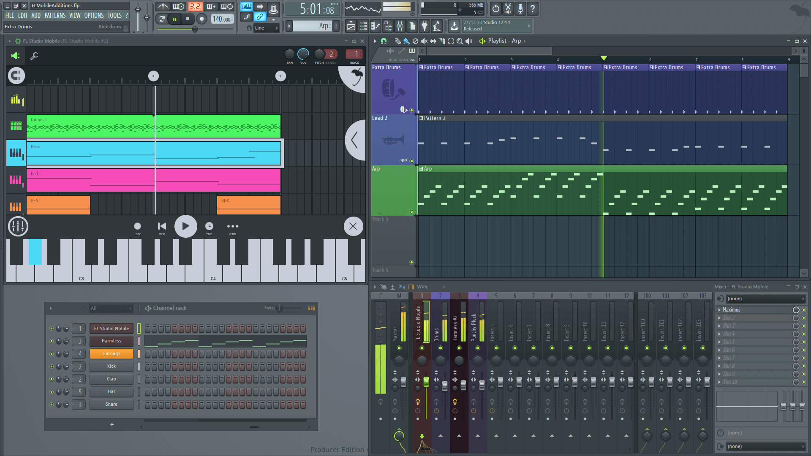

# FL Studio Mobile 插件

**FL Studio Mobile** 可以作为 [**FL Studio（桌面版）**][1]的免费插件使用，因此你可以将移动设备上的创作提升到一个新的高度。

**注意：** 从 FL Studio Mobile 3 开始，你只能在插件中加载 .flm 工程，.flm 工程文件已经不再与 FL Studio 直接兼容。

### FL Studio Mobile 插件

如何使用 FL Studio Mobile 插件：

1.  **重要信息：**FL Studio Mobile **插件** 会经常更新，请 **始终** [从 FL Studio 用户论坛][2] 上下载并安装最新的插件。
2.  将 FL Studio Mobile 上的工程传输到计算机上。请参阅本手册 [共享工程][3] 部分。**首次** 执行此操作时，请确保选择 **「SEND ALL」** 选项。这样会把移动设备上采样和乐器全部传输到 FL Studio 的插件中。
    
    https://www.bilibili.com/video/av29552167?p=3
    
3.  打开 FL Studio Mobile 插件，然后正常在 FL Studio Mobile（插件）中加载工程。
4.  FL Studio Mobile 插件会自动同步到 FL Studio 的播放界面。其加载速度取决于 FL Studio 所在计算机的性能。
5.  添加一个至少与 FL Studio Mobile 工程一样长的空样式，然后在 FL Studio（桌面版）中点击 Play 播放。
6.  完成上述步骤，你可以开始添加其他插件，并将 FL Studio 与提供核心工程的 FL Studio Mobile 一起使用。
7.  如果需要，你可以将 FL Studio Mobile 中的每个轨道连接到 FL Studio 中数个单独的轨道上。请参阅 [FL Studio 插件连接][4]。
8.  你可以选择将 FL Studio Mobile 的每轨道 [Save as MIDI（另存为 MIDI）][5]，或将完整的工程 [Save to MIDI（保存到 MIDI）][6] 的方式，将 MIDI 文件导出 FL Studio Mobile 然后在 FL Studio 中加载。

#### 使用构想

如果将 FL Studio Mobile 工程视为轨道的核心。你可以在计算机和移动设备之间 [共享][3] `.flm` 文件，来创建和完善工程。当使用计算机时，你可以使用更加强大的 CPU 来支持专业的高质量乐器和效果插件来为润色你的工程。另外，你可以在 FL Studio 中制作比移动端更复杂的工程。将工程导回移动设备时，你可以使轨道静音来保证 CPU 占用率在可控范围之内。

[1]: https://www.image-line.com/flstudio/
[2]: https://support.image-line.com/redirect/flmobile_flplugin
[3]: HomePanel.md#sharingdata
[4]: Rack.md#flm_pluginrouting
[5]: Playlist.md#channel_menu
[6]: HomePanel.md#save