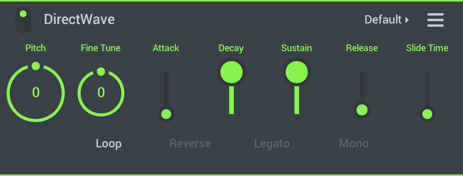
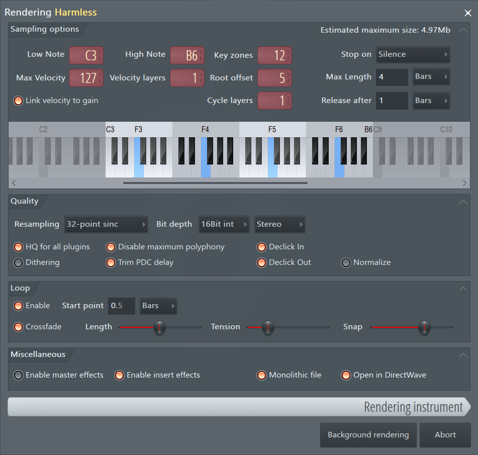
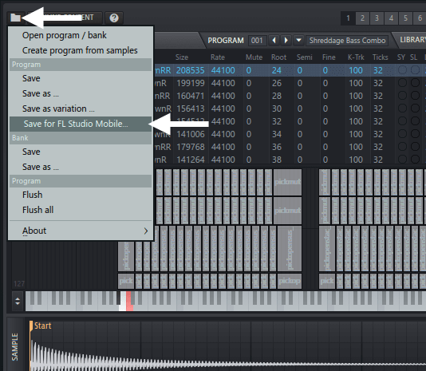

# DirectWave

DirectWave 是一个采样播放器，可用于 **钢琴**、**管弦乐队**、**吉他** 等传统声音。包含许多采样库您可以从 [应用内商店][1] 购买更多样本库或创建自己的样本库(见下文)。在 FL Studio Mobile 用户论坛上也有一个帖子（[链接在这里][2]），那里有很多可用的。

**加载乐器**——点击界面右上角的预设选择器（在上图中显示「Default」），然后从屏幕左侧的弹出浏览器中选择预设。请参阅以下有关添加您自己的自定义采样的「说明」。

## Parameters

DirectWave 是一个易于使用的采样播放器。它可以播放单个采样或多个采样。

*   **Pitch（音高）**——移调音高 ±24 个半音（两个八度）。
*   **Fine Tune（微调）**——移调音高 ±100%（一个半音）。
*   **Attack（起音）**——滤波器达到最高电平所需的时间。
*   **Decay（衰减）**——从最高最高到延迟电平所需的时间。
*   **Sustain（延持）**——按住键时的电平。
*   **Release（释音）**——松开琴键时，从延持电平降至零所需的时间。
*   **Slide time（滑动时间）**——从一个音符滑到另一个音符所花费的时间。**Legato（连奏）** 模式将限制滑动的重叠音符。
*   **Loop**——打开或关闭采样循环。这将取决于采样是否已具有内置循环点。
*   **Legato（连奏）**——当音符重叠时，它们将根据 **滑动时间（滑动时间）** 设置从一个滑动到另一个。在连音模式下（如果为 OFF），所有音符的变化将根据时间而滑动。
*   **Reverse（反转）**——反转采样（必须禁用循环才能工作）。
*   **Mono（单声道）**——新音符将减少持续音符。在 **Legato（连奏）** 模式下，新音符将从一个滑到另一个，但是原始采样将用于第二个音符。

**说明：**

*   **DirectWave 在哪里寻找采样？**——DirectWave 将扫描 [**用户文件**][3] 中的任何 WAV（8、16、24 或 32 位）和 MP3 格式的采样。它还将扫描 **.instr** 和 **.dwp** 多采样乐器（请参见下文）。

### 制作自己的多采样乐器

DirectWave 将加载 **.wav**、**.mp3**、**.dwp**（DirectWave 预设）和 **.instr**（FL Studio Mobile 乐器）。虽然 **.mp3** 和 **.wav** 仅限于通过键盘播放的单个采样，但 **.dwp** 和 **.instr** 格式支持多个采样，其中每个键可以包含唯一的采样或声音。关于 **.dwp 文件**：这些是 [FL Studio DirectWave Sampler][4] 原生的，并且 **有两种 .dwp 格式**：

*   **单个**——在单个 **.dwp** 文件中包含所有多样本数据。这是单个文件，易于管理，**是在移动设备上工作的理想格式**。
*   **标准（不推荐！）**——乐器预设包括 **.dwp** 程序和 **关联的子文件夹**（与 .dwp 同名），其中包含采样数据。FL Studio 电脑用户喜欢这种格式，因为他们可以轻松访问和编辑补丁样本数据。但是，由于在移动设备上管理文件和子文件夹的组很复杂，因此 **我们强烈建议使用单个 .dwp 格式**。

有几种方法可以使用 FL Studio 电脑版创建 DirectWave 预设：

1.  **[通道采样][5]**——在 **FL Studio 12.5** 和更高版本中可以用。这将从 [Channel Rack（通道机架）][6] 中的任何插件创建单个 DirectWave 预设。右击 Channel Rack（通道机架）按钮，然后选择 **「创建 DirectWave 乐器」**。确保在选项上选择了 **「Monolithic file（单个文件）」**。
    
    
    
2.  **[FL Studio DirectWave Sampler][4]**——如果您拥有电脑版的 DirectWave，则可以通过选择「Disk operations menu（磁盘操作菜单）」（在界面左上角的文件夹图标）并选择 **「Save for（保存为）FL Studio Mobile」** 来导出单个 .dwp 文件。将基于当前预设创建一个单个 .dwp 文件。
    
    
    
3.  **[FPC（水果打击垫）][7]**——从下面显示的菜单中，您可以通过选择 **「Save for（保存为）FL Studio Mobile」** 选项导出单个 **.dwp** 文件。
    
    
    

#### 将 .dwp 和 .instr 文件传输到 FL Studio Mobile

通常，您要将 DirectWave 的 **.dwp** 和 **.instr** 文件传输到 **My Instruments** 文件夹中。要将预设传输到 FL Studio Mobile 中，有几种方法：

1.  **FL Studio 电脑版**——将您创建的文件放入 **FL Studio Mobile 插件** 安装文件夹 **C:\\Program Files (x86)\\Image-Line\\FL Studio`【版本号】`\\Plugins\\Fruity\\Generators\\FL Studio Mobile\\LocalData**，然后使用 [共享功能][8] 发送到您的移动设备。
    
    https://www.bilibili.com/video/av29552167?p=3
    
2.  **系统传输**——在显示该文件类型（例如电子邮件）的移动应用程序中直接打开 .dwp 或 .instr 预设。它将被复制到 FL Studio Mobile。
    
    
    
3.  **手动传输**——将 **.dwp** 或 **.instr** 文件复制到 [你的数据/My Instruments][3]。如果您使用的是 iOS 设备，请 [通过 iTunes 将文件放在用户数据][9] 根文件夹中。或在设备上的任何浏览器，电子邮件等中打开 **.dwp** 或 **.instr** 文件。 FL Studio 将显示为打开选项。这样做会将它们导入到 [你的数据/My Instruments][3] 中（使用单独 .dwp）。

### 等等！还有更多……

**免费东西！**——FL Studio Mobile 用户论坛上有一个帖子（[链接在这][2]），用户可以在里面共享他们的 **.dwp** 和 **.instr** 预设。

[1]: HomePanel.md#shop
[2]: http://support.image-line.com/redirect/FLM_user_library
[3]: HomePanel.md#userdata
[4]: https://www.image-line.com/support/FLHelp/html/plugins/DirectWave.htm
[5]: https://www.image-line.com/support/FLHelp/html/plugins/DirectWave.htm#DirectWave_ChannelSampler
[6]: https://www.image-line.com/support/FLHelp/html/channelrack.htm
[7]: https://www.image-line.com/support/FLHelp/html/plugins/FPC.htm
[8]: HomePanel.md#sharingdata
[9]: HomePanel.md#userdata_ios