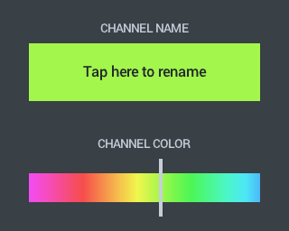
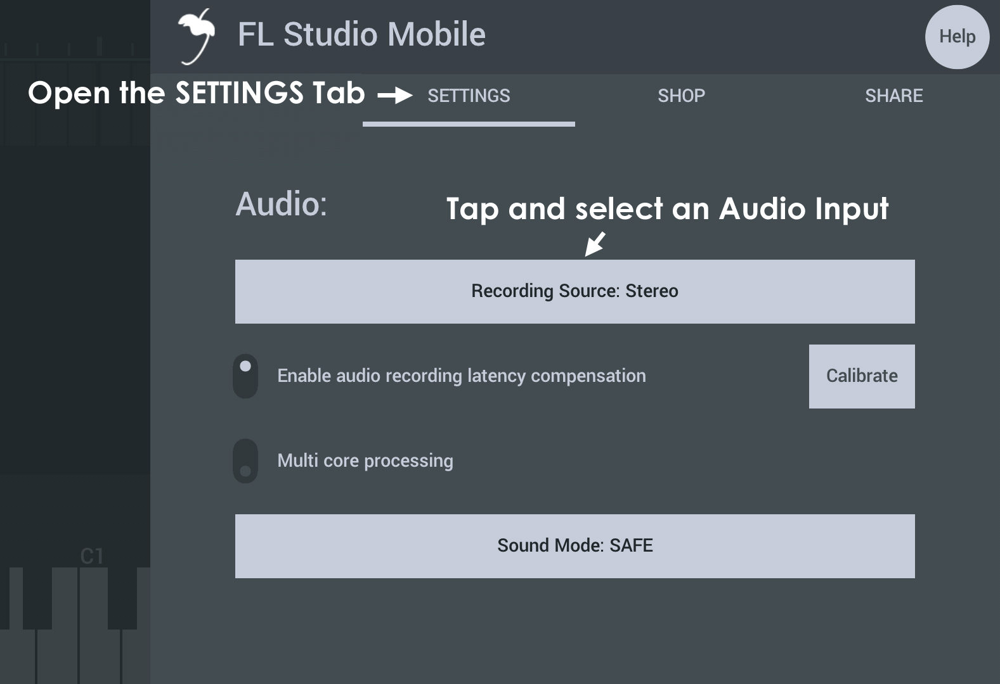
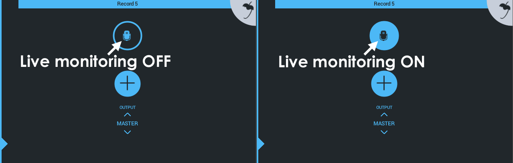
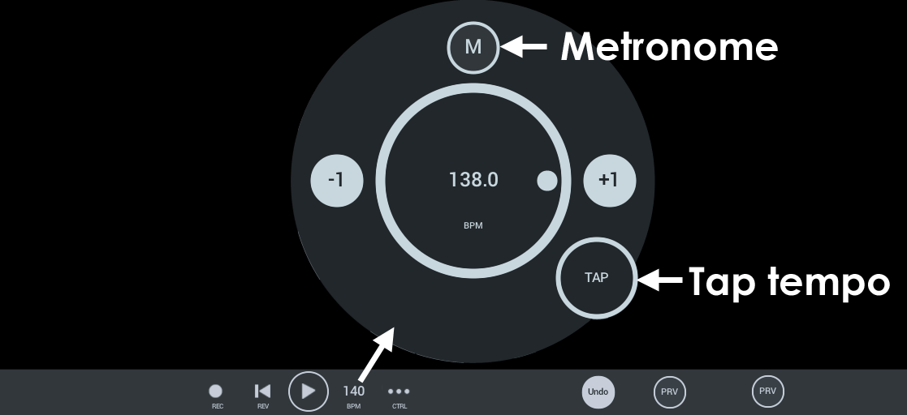

# 播放列表

播放列表是布置和编辑「音符」、「音频」和「自动化」来创作歌曲的地方。

## 参数

FL Studio Mobile 界面专为触摸而设计，因此使用了点击、短按和长按命令。

*   **通道菜单**——长按「轨道图标」来打开菜单并选择。  
    **注意：** 可见的选项取决于所使用的轨道类型以及其内容。
    *   **Save Template（保存模板）**——此选项可用于 [鼓通道][1]（步进音序器），并允许您保存自定义的鼓组。
    *   **Channel Settings（通道设置）**——通过点击名称来更改通道名称，或滑动颜色选择器以更改通道的颜色。
        
        
        
    *   **Hide/Show Tracks（隐藏/显示通道）**——隐藏/显示所选通道的所有子轨道。
    *   **Reverse sample（反转采样）**——音频片段轨道可以反转。
    *   **Add Track（添加轨道）**——添加一个子轨道到所选通道。
    *   **Import Sample（导入采样）**（仅 Windows）——打开一个对话框，从设备导入采样。导入采样后，您需要将其重新加载到所选轨道上。
    *   **Add StepSeq Track（添加步进音序器轨道）**——此选项可用于 [鼓通道][1]（步进音序器），并允许您创建普通步进音序器的子音轨。
    *   **Add Notes Track（添加音符轨道）**——此选项可用于 [鼓通道][1]（步进音序器），并允许您创建 **音符类型** 的子音轨。这些步骤就像音符一样，因此您可以通过以下方式来延长持续时间：点按该步骤并拖动右侧的拖动手柄，并创建复杂的时间，例如三连音和 1/64 音符（[此处为视频教程][2]）。音符轨道也可以是您手动录制步进音序器轨道时创建的样式。
    *   **Delete Track（删除轨道）**——删除所选子轨道。
    *   **Delete Channel（删除通道）**——删除所选通道和其所有子轨道。
    *   **Import MIDI Tracks（导入 MIDI 轨道）**——导入 MIDI (.mid) 文件。详见 [My Files > My MIDI][3]。轨道将添加到所选通道。
    *   **Import Sample（导入采样）**——从设备上可用的文件系统中加载采样。
    *   **Save as MIDI（另存为 MIDI）**——将当前通道另存为 MIDI (.mid) 文件。详见 [My Files > My MIDI][3]。
    *   **Sync All Samples（同步所有采样）**——将所有音频片段设置为同步模式。采样将与工程的速度锁定，因此当 BPM 或长度改变时，音高保持不变。
        
*   **轨道混合器**——短按（右键单击）打开。
    
    
    
*   **片段控制**——轻按一下即可打开。
    
    
    
    *   **Copy（复制）**——复制片段。如要放置，请长按您要放置的位置，然后选择 **粘贴**。
    *   **Del（删除）**——删除这个片段。
    *   **Snap（对齐）**——将片段边界与网格对齐。对齐选项位于播放列表的左上角（磁铁图标）。
    *   **Edit（编辑）**——打开片段编辑器。您也可以点按两次片段来打开编辑器。
    *   **More（更多）**——打开片段的其他选项：
        *   **Cut（切分）**——切分片段。
        *   **Combine（合并）**——在轨道上选择多个（单独的）片段后，会将它们组合为一个片段。
        *   **Mute（静音）**——片段播放时保持静音。
        *   **Unmute（取消静音）**——取消被静音的片段。
        *   **Less（更少）**——显示第一批「片段控制」菜单项。
    *   **调整片段大小**——音频和采样片段两端中心（高度）的手柄使您可以调整片段的大小（按住并拖动）。当片段中的数据结束时，片段将循环播放。
    *   **片段伸缩**——仅适用于音频剪辑。这使您可以拉伸片段时长。在 **实时** 调整时，音高将保持不变。取消选择时，音高将随长度变化。
*   **片段编辑器**——双击打开。根据片段的类型，将会打开钢琴卷帘、自动化片段编辑器、波形编辑器或步进音序器。
    
    
    
*   **时间选择选项**——选择时间轴后，将有一个 (+) 图标，点击此按钮将打开一个菜单。如果 (+) 图标不可见，请点击选区的其中一边：
    
    
    
    *   **Deselect（取消选择）**——移除时间轴上的选择。
    *   **Insert space（插入空间）**——插入时间等于选择的长度。跨选区的片段将在选区的开头进行切片，并移至右侧。将添加与选择的时间相等的时间。
    *   **Duplicate（重复）**——选区中的所有片段将在选区边界处切片并复制到右侧。
    *   **Delete（删除）**——选区中的所有片段将在片段边界处切片并删除。
    *   **Delete space（删除空间）**——选区中的所有片段将在片段边界处进行切片。时间和片段都将被删除，右侧的剪辑将向左移动。
    *   **Trim selection（修剪选区）**——片段将在选区边界处切片，选区之外的所有内容都将被删除（时间和片段）。
    
    
    
*   **添加轨道按钮 (+)**——点击打开。从中选择：
    
    *   **DirectWave（采样播放器）**——在通道机架中，点击 [插件菜单][4] 来打开样本/预设浏览器。
    *   **Minisynth（迷你合成器）**——实时合成器。
    *   **GMS（合成器）** (Groove Machine Synth)——实时合成器（需要另外购买）。
    *   **Transistor Bass（低音合成器）**——「TB-303 型」低音合成器（需要另外购买）。
    *   **Drum Sequencer（鼓音序器）**——[步进音序器][1] 轨道。
    *   **Audio Clip（音频片段）**——创建播放列表轨道，并将波形采样添加到该轨道。添加此轨道类型后，您将看到一个浏览器。请查看 [您的文件！][3]，来了解有关添加自定义采样以及浏览器在何处查找音频的信息。
    *   **Effect Track (AUX)（效果轨道）**——这些是专为托管 FX 插件而设计的音轨。使用 [通道机架][5] 底部的路径控制和 [Drum Sampler（鼓采样器）> Sample Tab（采样选项卡）> AUX][6] 控件将音频发送到效果轨道（AUX）。
    *   **Audio Record（录音）**——创建专用于录音的播放列表音轨。请查看 [您的文件！][3]，来了解更多有关保存录音的信息。

### 录音

从麦克风录音时，请务必 **戴上耳机**，以免 FL Studio Mobile 的音频与录音源混在一起。**设置录制：**

1.  检查 **[SETTINGS > Audio][7]**，来获取正确的音频输入。通常将其设置为「麦克风」（或「录制源立体声」）。仅当设备上有多个麦克风，正在使用 **USB 音频接口** 或没有音频录制时，才需要更改此控件。  
    **注意：** 对于音频接口，您可能需要测试输入选项以为您正在使用的麦克风或乐器（例如吉他）输入找到正确的选项。**Windows App** 用户，请参阅本节底部的「说明」。
    
    
    
2.  点击」添加轨道」图标，然后选择 **Audio Record（录音）**。
    
    
    
3.  [校准设备][8]（可选）——这通常只做一次并记住。每次重新启动应用程序时，某些设备都需要执行校准。目的是使录制的音频与播放列表准确对齐。
4.  可以选择打开通道机架来访问 **监听控件**。点击麦克风图标可静音/激活实时音频监听。  
    **OFF：** 输入已录制，但无法通过 FL Studio Mobile 听到声音。  
    **ON：** 输入已录制，也可以通过 FL Studio Mobile 听到声音。
    
    
    
5.  点击「录制」按钮并开始录制。

**说明：** 在 [SETTINGS（设置）][9]选项卡上，有些选项可能对您有用，包括：**「音频输入」**、**「录制时启用倒计时」**、**「节拍器音量」** 和 **「渲染和录制音频时使用 32 位格式」**。此外，**Sound mode: FAST（声音模式）** 可能会改善某些系统上的录音体验。  
对于 **Windows 设备**，您需要设置 **「SETTINS（设置）」>「Sound（声音）」>「Input（输入）」** 来匹配您正在使用的任何自定义音频接口，以使其在 FL Studio Mobile 中可见。

#### iOS 应用直接的音频 (IAA) 和 Audiobus

请参阅有关使用 [IAA 和 Audiobus 输入/输出][10] 的部分

### 控制栏

*   **REC**——录制，按播放开始。您还可以启用和取消动态录制。
*   **REV**——还原，将播放头返回到乐曲的开头。
*   **TMP**——速度控制器：
    *   **Metronome（节拍器）**——点击轨道。节拍器音量可通过 [Home > SETTINGS][11] 面板进行设置。
    *   **Set tempo（设置速度）**——拖动 BPM 拨盘，使用 +1 / -1 按钮或使用 Tap Tempo。
    *   **Tap tempo**——点击这里的速度将被设置为真实或想象的速度。
*   **CTRL（控制）**——链接到 CC，从 CC 取消链接或创建（自动化）参数轨道。
    
    **To create an Automation Clip/Track（创建自动化片段/轨道）**——您可以在 FL Studio Mobile 上自动化大多数可移动控件。所有旋钮和滑块。要为目标手动创建自动化片段，请执行以下操作：调整要自动化的控件。点击 CTRL，然后选择「添加自动化轨道」。
    
    1.  调整/移动目标控件
    2.  点击 **CTRL**
    3.  选择 **Add Automation Track（添加自动化轨道）**
    4.  点击自动化轨道并添加一个空的自动化片段
*   **Undo（撤销）**——撤消上一个动作。仅在对项目进行更改后可见。
*   **Prv（预览）** (Preview)——独奏所选轨道、模板或者音频片段的音频，具体取决于所选内容。

[1]: Editors.md#stepsequencer
[2]: Editors.md#stepsequencer_advanced
[3]: HomePanel.md#userdata
[4]: Rack.md#pluginmodule
[5]: Rack.md
[6]: Editors.md#drumtrack_tabs
[7]: HomePanel.md#audio
[8]: HomePanel.md#latency_compensation
[9]: HomePanel.md#settings
[10]: iOS_InterApp.md
[11]: HomePanel.md