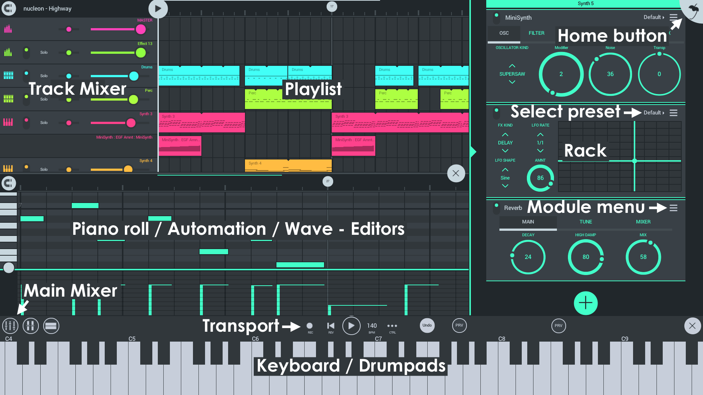

# FL Studio Mobile

**FL Studio Mobile 3** 是一个完整的音乐制作环境，适用于 Android，iOS 和 Windows 平台上的 App 以及作为 [FL Studio][1] 的插件使用。这样，您可以随时随地处理你的移动项目，然后继续在 FL Studio 中进行操作，将它们带入新的高度。

https://www.bilibili.com/video/av29552167?p=37

你可以在 [这里][2] 查看所有教程，并且在 [这里][3] 查看 **FL Studio Mobile 支持论坛**。这是一个提出问题并获得其他免费内容的好地方。要访问论坛，请点击 **HELP > Users & support forums**。如果这是您第一次访问该页面，则将要求您注册以获得访问权限。如果您已经有一个 [Image-Line Account][4] 帐户，请确保使用相同的登录密码。

### 获取软件

FL Studio Mobile 可以在 **Android**、**iOS** 和 **Windows**（作为应用或者 FL Studio 的插件）上运行。

[][5] [][6] [][7]

## 概括

FL Studio Mobile 是为了在从手机大小到电视大小的触摸显示器的任何屏幕上工作而设计的。每个 FL Studio Mobile 3 播放列表轨道都有一个关联的「轨道机架」。它可以容纳任意数量的乐器和效果插件。唯一的限制是您的CPU能力。现在，还可以像在 FL Studio 电脑版一样编辑自动切片的轨道。

### Instruments（乐器）

*   [**DirectWave**][8]【**免费**】——这是一个采样播放器，可用于 **钢琴**，**管弦乐队**，**吉他** 等传统声音。其中包括许多采样库。或者，你可以去 [应用内商店][9] 购买更多采样。
*   [**MiniSynth**][10]【**免费**】——一款功能齐全的**合成器**，处理器开销低，音质出色。在用户论坛上有1000个补丁可供使用，或者您可以创建自己的补丁。
*   [**GMS（Groove Machine Synth）**][11]【应用内购】——这是从 FL Studio（电脑版）[Groove Machine plugin][12] 移植的，是多音色混合合成器还有 FX 通道。
*   [**Transistor Bass**][13]【应用内购】——这音是一种单声道低音 **合成器**，用于创作谐振式的低音和主旋律。

### Workspaces（工作区）

*   **[Home Button][14]**——加载和保存工程，MIDI 控制输入，CPU、音频设置，节拍器响度和应用内购商店。
*   [**Playlist**][15]——安排音符，[自动化][16] 和音频剪辑以创作歌曲。
*   [**Rack**][17]——添加乐器和效果。
*   [**Main Mixer**][18]——调整电平、声道和独奏。
*   [**Editors**][19]——取决于在播放列表中选择的剪辑。合适的编辑器将显示在此处。使用钢琴卷，自动化和波形编辑器。
*   [**Keyboard、Drumpads 和 MIDI Controllers**][20]——根据音轨类型（鼓或音符）此处将显示适当的控制器（键盘或鼓垫）

### 注册，为什么重要！

当你首次点击 **HELP > Users & Support forums** 时，我们会要求您将设备注册到您的 Image-Line 帐户。

*   你可以在 [FL Studio Mobile 支持论坛][3] 上发布或者下载访问权限，在这里可以直接获得来自来发团队的**技术支持**，以及与其他用户交谈。
*   论坛上还有许多其他的免费采样、乐器和预设，包括： [DirectWave][21]、[MiniSynth][22]、[GMS][23] 和 [Transistor Bass][24].
*   我们解锁了你的内容，可用于 [FL Studio 插件版本][25].

### 常问问题

*   **如何将项目另存为音频或音乐文件？**——在 [主页面板][14] 上点击 **Save > MP3 or WAV**。你的音频文件将放在 FL Studio Mobile 用户文件夹下的 **My Tracks**。如果您的操作系统支持，则还可以选择其他保存位置。
*   **我在哪里可以获得技术支持？**——注册 FL Studio Mobile 并访问 [FL Studio Mobile 支持论坛][3]。
*   **如何提出功能请求和建议？**——注册 FL Studio Mobile 并访问 [FL Studio Mobile 支持论坛][3]。
*   **如何获取该应用程序的 FL Studio 插件版本？**——从 [FL Studio 12.4][26] 开始包含 [FL Studio Mobile 插件][27]。在 [此处][28] 查看插件的更新。您需要的版本等于或晚于该版本。桌面版 FL Studio 包含终身免费更新，因此，在购买后，您将始终免费获得最新版本。就像一个应用程序一样！

[1]: https://www.image-line.com/flstudio/
[2]: https://www.bilibili.com/video/av29552167
[3]: https://support.image-line.com/redirect/flmobile_forum
[4]: https://support.image-line.com/member/profile.php
[5]: https://apps.apple.com/cn/app/fl-studio-mobile-hd/id432850619
[6]: https://play.google.com/store/apps/details?id=com.imageline.FLM
[7]: https://www.microsoft.com/store/apps/9nblggh1zjcr
[8]: FL%20Studio%20Mobile_Module_DirectWave.md
[9]: FL%20Studio%20Mobile_HomePanel.md#shop
[10]: FL%20Studio%20Mobile_Module_Minisynth.md
[11]: FL%20Studio%20Mobile_Module_GMS.md
[12]: https://www.image-line.com/support/FLHelp/html/plugins/GMS.htm
[13]: FL%20Studio%20Mobile_Module_TransistorBass.md
[14]: FL%20Studio%20Mobile_HomePanel.md
[15]: FL%20Studio%20Mobile_Playlist.md
[16]: FL%20Studio%20Mobile_Editors.md#automationclip
[17]: FL%20Studio%20Mobile_Rack.md
[18]: FL%20Studio%20Mobile_Mixer.md
[19]: FL%20Studio%20Mobile_Editors.md
[20]: FL%20Studio%20Mobile_Controllers.md
[21]: https://forum.image-line.com/viewtopic.php?f=1964&t=78796
[22]: https://forum.image-line.com/viewtopic.php?f=1964&t=119657
[23]: https://forum.image-line.com/viewtopic.php?f=1964&t=164423
[24]: https://forum.image-line.com/viewtopic.php?f=1964&t=164424
[25]: https://support.image-line.com/redirect/flstudiomobile_plugin
[26]: https://www.image-line.com/downloads/flstudiodownload.html
[27]: FL%20Studio%20Mobile_FLStudioPlugin.md
[28]: https://support.image-line.com/redirect/flmobile_flplugin