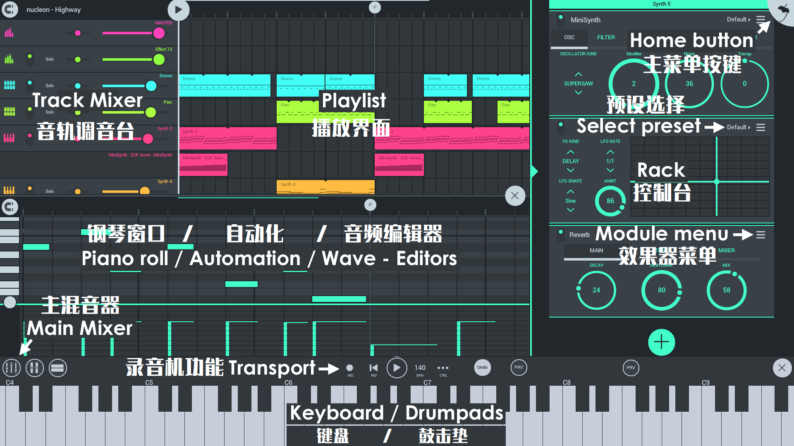

# FL Studio Mobile

**FL Studio Mobile 3** 是一个拥有完整音乐制作环境的适用于 Android，iOS 和 Windows 平台的应用，也可以作为 [FL Studio][1] 的插件使用。这样，你可以随时随地在移动设备上开始你的工程，然后在 FL Studio 中继续编辑，将它提升到一个新的高度。

https://www.bilibili.com/video/av29552167?p=37

你可以点击 [这里][2] 查看所有视频教程，也可以点击 [这里][3] 访问 **FL Studio Mobile 支持论坛**。你可以在论坛中提出问题、获取其他免费内容。在应用内点击 **HELP > Users & support forums** 可以访问论坛。如果这是你第一次查看，我们会要求你注册账户以获得访问权限。如果你已经有 [Image-Line 账户][4]，请确保使用相同的登录信息。

### 获取软件

FL Studio Mobile 可以在 **Android**、**iOS** 和 **Windows**（独立应用或 FL Studio 插件）运行。

[][5] [][6] [][7]

## 概述

小到手机屏幕，大到电视荧屏， FL Studio Mobile 可以在任何屏幕上运行。FL Studio Mobile 3 中的轨道都有一个控制台，在CPU的性能足够的条件下，你可以随心所欲的添加乐器和效果器。可编辑的自动化轨道可以让你如同在 FL Studio 上一样为你的工程增色。

### Instruments 乐器

*   [**DirectWave**][8] [**免费**] - 这是一个采样播放器，多用于传统音色，如 **钢琴**，**管弦乐**，**吉他** 等。预设中有很多采样可供你使用，你也可以在 [应用内商店][9] 购买更多采样。
*   [**MiniSynth**][10] [**免费**] - 这一款功能齐全的 **合成器**，很少的处理就能得到非常棒的音色。你可以自己制作音色，也可以在用户论坛上找到超过 1000 个可供使用的预设。
*   [**GMS（Groove Machine Synth）**][11][应用内购] - 这是一个移植 FL Studio（PC）[Groove Machine 插件][12] 的 FX 效果 & 多音色混合器。
*   [**Transistor Bass**][13] [应用内购] - 这是一个适用于单音 Bass-line 风格的 **合成器**，用于创作 Resonant 风格的 Basslines 或 Leads 。

### Workspaces 工作区

*   **[Home Button][14] 主菜单** - 加载和保存工程，MIDI 输入， CPU /音频设置，节拍器响度和内购商店。
*   **[Playlist][15] 播放界面** - 创作你的音乐，排布节奏，设置[自动化][16] 和音频剪辑。
*   **[Rack][17] 控制台** - 添加乐器和效果。
*   **[Main Mixer][18] 主混音台** - 调整电平、声道和独奏。
*   **[Editors][19] 编辑器** - 显示内容取决于你在播放界面选择的轨道的类型。编辑器会在图示位置显示，供使用钢琴窗口，自动化和波形编辑器。
*   **[Keyboard、Drumpads 和 MIDI Controllers][20] 键盘、鼓机以及 MIDI 控制器** - 根据音轨类型显示对应的控制器（键盘或鼓机），控制器位置会在图示位置显示。

### 关于注册！

当你第一次点击 **HELP > Users & Support forums** 时，我们会要求你将你的设备注册到你的 Image-Line 帐户。

*   你可以在 [FL Studio Mobile 支持论坛][3] 上发布或下载数据。在这里你可以直接获得来自来发团队的 **技术支持**，也可以与其他用户交谈。
*   论坛上有大量免费的采样、乐器和预设，包括： [DirectWave][21]、[MiniSynth][22]、[GMS][23] 和 [Transistor Bass][24]。
*   我们会解锁你 [FL Studio 的插件版本][25]，你可以免费获得 FL Studio Mobile 的最新版本。

### 常问问题

*   **如何将工程另存为音频或音乐文件？**- 在[主菜单][14]上点击 **Save > WAV、FLAC 或 MP3**。你的音频文件会保存在 FLM User Files 下 **My Tracks** 文件夹中。如果你的操作系统支持，则还可以选择保存在其他位置。
*   **我在哪里可以获得技术支持？**- 注册 FL Studio Mobile 并访问 [FL Studio Mobile 支持论坛][3]。
*   **如何提出功能需求和建议？**- 注册 FL Studio Mobile 并访问 [FL Studio Mobile 支持论坛][3]。
*   **如何获取该应用的 FL Studio 插件版本？**- 从 [FL Studio 12.4][26] 版本开始支持 [FL Studio Mobile 插件][27]。点击 [此处][28] 查看更新。你需要使用12.4及以后的 FL Studio。FL Studio 终身免费更新，因此在你购买后，你将始终免费获得最新版本。就像一个独立程序一样！

[1]: https://www.image-line.com/flstudio/
[2]: https://www.bilibili.com/video/av29552167
[3]: https://support.image-line.com/redirect/flmobile_forum
[4]: https://support.image-line.com/member/profile.php
[5]: https://apps.apple.com/cn/app/fl-studio-mobile-hd/id432850619
[6]: https://play.google.com/store/apps/details?id=com.imageline.FLM
[7]: https://www.microsoft.com/store/apps/9nblggh1zjcr
[8]: Module_DirectWave.md
[9]: HomePanel.md#shop
[10]: Module_Minisynth.md
[11]: Module_GMS.md
[12]: https://www.image-line.com/support/FLHelp/html/plugins/GMS.htm
[13]: Module_TransistorBass.md
[14]: HomePanel.md
[15]: Playlist.md
[16]: Editors.md#automationclip
[17]: Rack.md
[18]: Mixer.md
[19]: Editors.md
[20]: Controllers.md
[21]: https://forum.image-line.com/viewtopic.php?f=1964&t=78796
[22]: https://forum.image-line.com/viewtopic.php?f=1964&t=119657
[23]: https://forum.image-line.com/viewtopic.php?f=1964&t=164423
[24]: https://forum.image-line.com/viewtopic.php?f=1964&t=164424
[25]: https://support.image-line.com/redirect/flstudiomobile_plugin
[26]: https://www.image-line.com/downloads/flstudiodownload.html
[27]: FLStudioPlugin.md
[28]: https://support.image-line.com/redirect/flmobile_flplugin