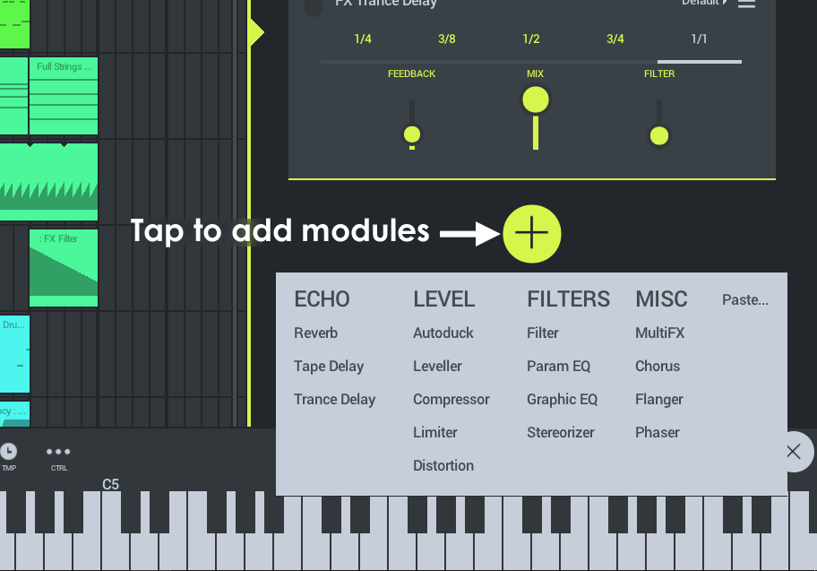

# 通道机架

每个播放列表音轨都有自己的「通道机架」。它包含该播放列表轨道的乐器和效果插件。机架模块堆叠在一起，您可以同时使用 [乐器][1] 和 [效果模块][2]。

## 通道机架

要打开通道，请在播放列表中选择轨道，然后点击播放列表右侧的频道架打开控件。

*   **通道**——播放列表通道主要有三种类型：**乐器**（通道机架将同时容纳乐器和 FX 模块）、**音频** 和 **FX**（后两个通道机架仅容纳 FX 模块）。
*   **处理顺序**——机架中乐器和效果器的顺序决定了处理顺序（顶部优先，底部最后）。例如：如果加载 DirectWave > Distortion（失真）> MiniSynth（迷你合成器）> Reverb（混响）。播放列表将同时播放 DirectWave 和 MiniSynth。但是，DirectWave 将通过「失真 + 混响」效果进行传递，而 MiniSynth 将仅具有混响效果。

您也可以为分组的子混音创建 FX 机架。请参阅下面的 [音频路由][3]。

### 插件模块

插件的右上方有两个菜单项，如下所示。**左侧菜单** 允许您打开预设。**右侧菜单** 允许您重新排序、复制和删除插件模块。

要从一个机架 **复制并粘贴一个机架** 到另一个机架，请打开模块菜单，点击「复制」，然后选择新的机架，使用底部的 (+) 按钮并使用「粘贴」。

### 乐器模块

这里有 4 种乐器和 1 个鼓采样器：

*   [DirectWave（采样播放器）][4]——这是一个基于多采样的播放器。它可以加载 DirectWave（FL Studio 电脑版格式）的 .dwp 文件。这也是您可以访问购买的基础采样的乐器和自定义采样/乐器的方式。
*   [MiniSynth（迷你合成）][5]——这是功能齐全的合成器，处理器功耗低，音质好。加载预设或从头开始创建自己的声音。有 6 个选项卡涵盖了合成器控件。
*   [GMS（合成器）(Groove Machine Synth)][6]【演示】——如需另外购买，请参阅 SHOP（商店）页面。这是来自 FL Studio 电脑版的 [Groove Machine 插件][7]，是多音色混合合成器还有 FX 通道。
*   [Transistor Bass（低音合成器）][8]【演示】——如需另外购买，请参阅 SHOP（商店）页面。这是一种单声道低音合成器，用于创作谐振式的低音和主旋律。
*   Drum Sampler（鼓采样器）——虽然不是可以装入机架的乐器，但它是播放列表音轨的一种类型。它具有步进音序器和多通道鼓采样播放器。

### 效果模块

这里有许多可用的效果。  
注意: 为了节省 CPU 负载以及希望将效果应用到所有轨道，而不是在每个轨道上都放置相同的效果，请向主 FX 轨道添加一个效果。所有音频最终都通过此轨道。

*   [Autoduck（闪避）][9]——闪避是一种自动压低音量的方式。使用它来创建「侧链」样式效果。
*   [Chorus（合唱）][10]——通过使声音中的多个声音失谐来创建更浓密的声音。
*   [Compressor(压缩器)][11]——压缩是（非常快的）自动音量控制的一种方式，它可以缩小强音和柔音之间的差异。即，音频波形的峰谷之间的电平差。当输入信号超过阈值时，增益或允许信号电平增加的速率会降低。换句话说，是波形幅度被「压缩」。
*   [Distortion（失真）][12]——该放大器模拟吉他放大器典型的失真类型「过载」。即使轨道的音量很小，它也可以实现高过载。
*   [Equalizer（均衡器）(Parametric)][13]——均衡是增加或降低特定频率的响度的过程。先进的 4 波段参数均衡器。频段类型（形状），每个频段的中心频率和宽度是完全可调的。您可以选择：High Shelf、Low Shelf 和 Peaking。
*   [Filter（滤波器）][14]——与均衡器类似，但是它们的设计更多地用于创作（自动）效果。扫频滤波器的截止频率是电子舞蹈音乐 (EDM) 中非常常用的技术。
*   [Flanger（镶边）][15]——与合唱效果类似，镶边可让您立体全景混音更加丰富。
*   [Graphic EQ（图形均衡器）][16]——均衡是增加或降低特定频率的响度的过程。这是一个 8 波段均衡器，其滑块设置为方便的频率范围，用于一般均衡任务。
*   [IAA/Audiobus][17]——用于处理应用间音频和 Audiobus 的输入/输出模块（仅限 IOS）。
*   [Leveller（电平器）][18]——精确的音量控制。使用电平器监控电平，并对电平和立体声声像进行精确更改。
*   [Limiter（限制器）][19]——限制是重压缩的一种形式（通常用于描述大于 10：1 的压缩比）。目的是将输出电平「限制」到设定的最大电平（通常为 0 分贝），以避免在最终混音中出现限幅。限制器可用于在不引起明显失真的情况下极大地最大限度地提高音轨的电平，因此限制是母带制作中常用的效果。
*   [Multi FX（多功能效果器）][20]——结合了 Delay（延迟）、Reeverb（混响）、Low Pass Filter（低通滤波器）、High-Pass Filter（高通滤波器）、Flanger（镶边）、Phaser（移相器）、Panner（偏移器）和 Vox 滤波器。这些由和 X/Y 坐标控制。对于组合效果和自动化很有用。
*   [Phaser（相位器）][21]——相位调节双声振荡器的相对相位。振荡器声音会延迟不同的量，从而导致移动频率抵消效果，即使您不太了解它的工作原理，您也可以识别它。
*   [Reverb（混响）][22]——混响模拟特定类型（大厅/峡谷/房间）和大小的房间。
*   [Stereoizer（立体声器）][23]——立体声器可从单声道源创建立体声效果。用它来创建「更广泛」的混音。
*   [Tape Delay（磁带延迟）][24]——延迟是回声类型的效果，对于速度过快的实验性延迟声音特别有效。
*   [Trance Delay（Trance 延迟）][25]——延迟是回声类型的效果，与轨道的主速度同步播放时特别有效。

### 复制模块

*   **Paste（粘贴）**——将模块添加到复制/粘贴缓冲区中，包括当前设置。当您在模块菜单中使用 **复制** 命令时激活（如上图 **插件模块** 部分所示）。

### 音频路由

默认情况下，所有通道机架都被路由到 **主调音台 FX 轨道**。使用通道架底部的「OUTPUT（输出）」控件将音频从所选通道发送到项目中的任何 FX 通道。您还可以创建新的 FX 通道。FX 通道 **专为处理音频而设计**，因此只有 FX 模块可以被通过 (+) 按钮添加到这些通道架中。使用 FX 通道创建子混音，以便对效果器进行分组处理。

点击 **添加模块** 按钮 (+)，来访问：

*   **Create FX Channel（创建 FX 通道）**——添加一个 **FX 通道** 到播放列表中。在 FX 通道上加载 FX 模块，并将多个音轨路由到该通道以进行组 FX 处理。
*   **Send to（发送到）**——从现有的 FX 通道列表中选择。  
    **注意：** **Master（主控）** 总是可用的，因为它是根据设计添加到所有项目中的。上面的示例显示了两个 FX 通道已添加到项目中（可以通过 **长按「轨道头部」>「Channel Settings（通道设置）」> 并点击重命名区域** 来重命名它们）。

**注意：** 您可以通过「Send to（发送到）」来链接 FX 通道。

#### FL Studio 插件版路由

将 FL Studio Mobile 用作 FL Studio 电脑版的插件时，您还可以选择将任何 Racks 输出发送到任何 FL Studio Mixer 轨道。

[1]: #instrumentmodule
[2]: #effectmodule
[3]: #flm_routing
[4]: Module_DirectWave.md
[5]: Module_Minisynth.md
[6]: Module_GMS.md
[7]: https://www.image-line.com/support/FLHelp/html/plugins/GMS.htm
[8]: Module_TransistorBass.md
[9]: Module_Autoduck.md
[10]: Module_Chorus.md
[11]: Module_Compressor.md
[12]: Module_Distortion.md
[13]: Module_ParametricEQ.md
[14]: Module_Filter.md
[15]: Module_Flanger.md
[16]: Module_GraphicEQ.md
[17]: iOS_InterApp.md
[18]: Module_Leveller.md
[19]: Module_Limiter.md
[20]: Module_MultiFX.md
[21]: Module_Phaser.md
[22]: Module_Reverb.md
[23]: Module_Stereoizer.md
[24]: Module_TapeDelay.md
[25]: Module_TranceDelay.md